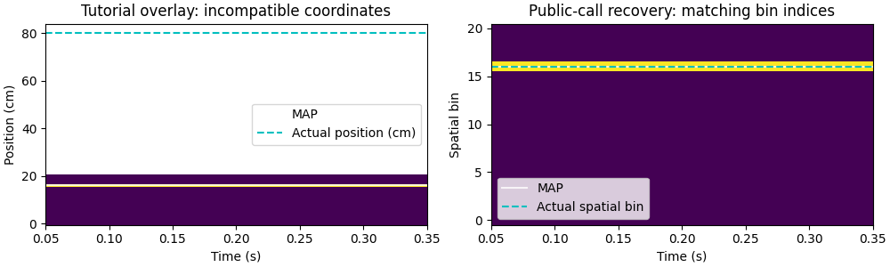

# Researcher-workflow checkpoint — 2026-10-07, after Phase 4c

**Decision: HOLD before Phase 5a.** All five journeys complete from current
public documentation and runtime help. The graph-track journey is now smooth,
and the duration, geometry/direction and statistical-interpretation blockers
from the [first checkpoint](RESEARCHER_WORKFLOW_CHECKPOINT_2026-10-07.md) are
closed. A newly verified scientific display error in decoding tutorial 20
still mixes centimeters with spatial-bin indices. A bounded Phase 4d corrects
that example before another checkpoint; this report does not implement it.

Reviewed integration `cf3fb2868c23bab08e3748cf00ced12deedf761f`, after checkpoint
PR #46 and Phase 4c PR #47 merged (`fe26a44c` and `d900d073`). See the companion
[UX review](UX_REVIEW_2026-10-07_POST_4C.md),
[design review](DESIGN_REVIEW_2026-10-07_POST_4C.md), and the Phase 4d plan at
`.claude/docs/plans/researcher-first/phase-4d-decoder-plot-docs.md`.

## Method and limits

The two previously authorized independent reviewers repeated the five journeys
from current README/guides/public notebook companions and public signatures,
docstrings, exports and result attributes. The lead repeated all three UX
probes, reran earlier scripts as comparison controls, executed the new joined
graph recipe and a linear population route, and independently reproduced the
new display error with a perfect analytic posterior.

This uses the journey, probe and rating scopes of `.claude/workflows/ux-review.js`
and `design-review.js`, adapted to direct execution rather than their
Claude-specific runner. The checkpoint's documentation-only rule overrides
the workflow scripts' implementation-inspection prompts. **Implementation
reads: 0; test reads: 0; required source-reading fallbacks: 0** in this repeat,
for both reviewers and the lead. Traceback/warning filenames were observed
without opening those files. No private helper imports or mutations were used.

The lead retains prior Phase 4c implementation context, so its controlled
reruns are not described as blind first-user discovery. The independent
walkthroughs supply the fresh discovery/recovery judgments. One reviewer's
broad public-doc search initially returned older review text; it was excluded
from that reviewer's recipe/evidence and the search was narrowed. Plans were
read for scope and follow-up allocation only.

All project extras were installed with `uv sync --all-extras`. Scripts ran
through `uv run` from temporary directories, with Matplotlib Agg. All new
fixtures contain at most 60 seconds of data. No interactive browser, Napari,
widget or assistive-technology session was run. Synthetic decoding is in-sample;
these examples establish no held-out accuracy, biological assemblies or
validated cell-type classification.

The original October audit is available only as its qualitative record:
UX **CONFUSING**, all five design journeys **painful**. Its call/line counts
remain unavailable. The initial October 7 checkpoint is available for a
qualitative comparison, but these fresh scripts use different fixtures and
reporting/check overhead. **No percentage or normalized call/LOC reduction is
claimed against either baseline.**

## Journey measurements

These are the exact successful independent scripts reproduced in the appendix.
LOC counts nonblank, noncomment physical lines, including imports, fixtures,
plots, checks and reporting. Calls count syntactic AST `Call` sites, including
NumPy/printing, not dynamic loop invocations. Neurospatial calls include
documented constructors, environment/model/result methods. Discovery and
measurement scaffolding are excluded; no count is a frozen target or test.

| Journey | Current rating | LOC | All calls | Neurospatial calls | Source reads |
| --- | --- | ---: | ---: | ---: | ---: |
| NWB components → epochs → population maps → decode → table/plot/HTML | workable | 32 | 45 | 10 | 0 |
| Graph track → geometry → inbound/outbound trials → directional fields | smooth | 47 | 47 | 12 | 0 |
| Heading/egocentric frame → object-vector map and candidate screen | workable | 51 | 90 | 27 | 0 |
| Linear simulation → population encode/decode → assembly/EV statistics | workable after plot recovery | 53 | 108 | 18 | 0 |
| Events → PSTH/raster → regressors → positioned events | workable | 50 | 78 | 9 | 0 |

The NWB input fixture is separate overhead: **20 LOC / 19 calls / 1 neurospatial
call**. The extra event-cohort probe is **31 / 43 / 5**, outside journey 5's
count. Public-helper calls and result receivers are classified explicitly in
the reviewers' static measurement scripts. The complete scripts below allow
physical LOC and total calls to be recomputed without implementation reads.

### What completed

- **NWB:** real HDF5 input with a tracking gap `[12,16)`, selected epochs
  `[2,10)` and `[18,26)`, and explicit ephys window `[0,30)`. Eager arrays
  remain usable after file close. `environment_from_position` detects cm;
  six nondefault unit IDs `[101,103,107,109,113,127]` survive to the table.
  Positions `(2600,2)`, maps `(6,37)`, posterior `(160,37)`, 16.0 s shared
  occupancy and zero decoded bins in `[10,18)`. Posterior row-sum error
  ≤3.34×10⁻¹⁶. Real static field and 32-frame posterior/position HTML exports
  completed. Explicit frame labels jump from `t=9.55 s` to `t=18.05 s`.
- **Graph:** the new complete guide recipe supplies geometry, regions, trials
  and labels in one place. Twelve successful trials; repeated coordinates
  `[25,50,75,50,25]` map to bins `[4,9,14,9,4]`. Planted peaks 60/40 cm recover
  at 62.5/42.5 cm, within one 5 cm bin. Two labeled plots complete the journey.
- **Egocentric:** 55 seconds, positions `(2750,2)`, finite headings, bearing/
  distance `(2750,1)`, flat maps `(96,)` with 69 finite bins. Angle checks
  establish ahead/left/right as 0/+π/2/−π/2. Both synthetic object-vector and
  place models pass the current information screen and illustrative manual
  thresholds. This remains a candidate-screen/coverage limitation assigned to
  Phases 5a/5b, not evidence of biological identity or tuned ground-truth recovery.
- **Population/statistics:** the linear convenience now supplies the requested
  45 seconds (22,500 samples, final time 44.998 s) without switching helpers.
  Twelve maps `(12,21)`, counts `(449,12)`, posterior `(449,21)`; manual and
  session posteriors agree exactly. In-sample median error 5 cm is descriptive.
  Two PCA dimensions/patterns have empty thresholded member sets, consistent
  with current docs. Controlled EV/REV 0.331531/0.125743; no-control EV=REV
  0.875676. Amplified-template strengths ≈3. The sparse example retains mean
  zero/std one with 10% of activations above 2, without calling it a p-value.
- **Events:** 50 seconds/161 spikes; 11 events → 9 retained/2 dropped;
  60-bin PSTH peaks at +0.1375 s and 40 Hz. The same retained cohort supplies
  nine raster rows and nine positioned events; regressors form `(1000,6)`.
  A separate gap probe shows six position-valid events but only two full-window
  PSTH events, as current help explains. Regressor construction is demonstrated;
  no fitted-GLM inference is claimed.

## Phase 4c closure

| Prior blocker | Fresh evidence | Disposition |
| --- | --- | --- |
| Requested lap duration ignored while metadata claims it | Independent 1/2 s calls produce 500/1000 samples ending 0.998/1.998 s; both traversals and spike clock preserved. Lead also runs the full 60 s linear encode/decode/statistics route. | Closed by merged Phase 4c. |
| Linearization conflated with direction/history | Current joined guide repeats geometric bins and supplies explicit trial labels; both planted directional peaks pass. Notebook caveats distinguish single-edge behavior from branch assignment. | Closed by merged Phase 4c. |
| Activity/EV cutoffs misrepresented as significance | Current public help separates descriptive thresholds from inference and defines controlled REV correctly. Sparse activity and controlled/no-control EV checks agree. | Closed by merged Phase 4c. |

The lead's exact small reproducer uses the original 1 cm track/0.2 cm bins,
two traversals/two cells and seed 42: 1/2 s requests now produce 500/1000
samples ending 0.998/1.998 s, replacing the earlier identical 9,387-sample,
18.772-second recordings. The related 1-second, one-trial T-maze also ends
at 0.998 s with 500 samples. An infeasible 0.5 s request states the 254-sample
budget and suggests duration ≥0.508 s, fewer traversals or shorter pauses.
Neither data nor downstream timestamps were rescaled in a recipe.

## New blocker: tutorial 20 overlays different spatial coordinates

Both the golden and manual posterior cells in
`examples/20_bayesian_decoding.py` and its docs mirror call `result.plot`,
then draw physical actual positions on the posterior's spatial-bin axis and
relabel it as centimeters. Golden-cell evidence: lines 248, 258, 265–274;
manual cell: lines 440–454. Matching notebook code cells are
`d61f1740` and `plot-posterior`. Source-cell parity was checked without relying
on saved notebook outputs. The advertised fixture uses 2 cm bins, so physical
coordinates and bin indices are not interchangeable.

Public `DecodingResult.plot` help explicitly defines spatial-bin indices on
the y-axis and its white MAP line as the highest-probability bin. Physical
`result.map_position` remains appropriate for cm-valued error computations
and separate physical-coordinate time-series/scatter plots. Renaming a plot
axis does not transform its data.

The independent reviewer encountered this while following the public tutorial
and recovered with `env.bin_at(actual)`. Its numeric decoding never failed.
The lead independently constructed a perfect four-row one-hot posterior:

```json
{"posterior_shape": [4,21], "bin_size_cm": 5,
 "actual_positions_cm": [80,80,80,80], "actual_bins": [16,16,16,16],
 "MAP_plot_y": [16,16,16,16], "numerical_median_error_cm": 0,
 "wrong_overlay_y": [80,80,80,80], "correct_overlay_y": [16,16,16,16]}
```



This is a scientific display contradiction: a perfect decoder appears wrong,
and its posterior coordinates are falsely labeled. It is a **high-priority
checkpoint blocker**, distinct from Phase 7's output/accessor polish.
The Phase 4d plan corrects both cells, synchronized copies, and adds a numeric overlay check for
non-unit bins and continuous/gapped decoder times. The existing decoder
calculation, plotting API and numerical defaults need no redesign.

## UX rerun and remaining planned work

The lead reran the exact earlier real-NWB UX fixture and first-field/error/
result probe. Results remain 78 bins, 59.99 s occupancy, 5.321 Hz first-field
peak and 1.176 bits/spike. Bare construction coaches factory use; invalid
position dimensions name shapes and a Fix; overly coarse grids and mismatched
spike clocks warn; the huge-grid warning was promoted to an exception before
allocation. Result reprs, six unit IDs and viridis/static Hz labels remain
usable. This is a repeatability control, not a fresh blind user rating.

Existing medium/low findings remain in their assigned later phases:

- Phase 6a: discoverable count-based population/statistics recipe and common
  unit selection across periods; assembly capabilities still require export/help
  discovery. Phase 5a/5b retain the planned frame/criterion work and bias examples.
- Phase 6b: shared full-window event cohorts, endpoint semantics and explicit
  decoder model handoffs. A result-like model works with `decode_position`;
  precomputed session models use `.firing_rates` in the NWB route.
- Phase 6c: a joined component/holder NWB recipe with units, acquisition windows,
  analysis epochs and identity, replacing guide emphasis on Session/load_session.
- Phase 7: native 1D rate-result plotting still raises the pcolormesh 2D-grid
  error; graph plotting and an ordinary labeled 1D line plot complete these
  journeys. Single/batch summary/xarray parity, table units/thresholds and safer
  exports remain planned. Existing tables have empty attrs and 4 versus 9 columns.
- Optional wording: notebook 05's introductory “GraphLayout engine handles this
  automatically” sentence could explicitly name geometry after its directional
  use-case bullet. The new caveats and joined recipe already supply the correct
  interpretation, so this residual ambiguity is not a gate blocker.

## Gate and next step

The five corrected routes are clearly easier than the qualitative October
all-painful baseline; the track route improved from painful in the first
checkpoint to smooth with a complete current recipe. **The gate remains held
because advertised scientific plots still contradict their coordinate contract.**
Both reviewers report zero implementation/test reads; the reviewer who found
the plot mismatch independently agrees it warrants the hold.

Next: implement Phase 4d, merge it, then repeat the checkpoint before Phase 5a.
This review changes reports/plans only. It does not change library algorithms,
simulation defaults, classification thresholds or tutorial code.

## Reproduction appendix

Save each exact block below using its stated filename and run it from a fresh
temporary directory with `MPLBACKEND=Agg uv run --project /path/to/neurospatial
python <filename>`. Install all extras first. Run `nwb_fixture.py` before
`nwb_workflow.py`. Scripts write their real PNG/HTML/JSON outputs into that
directory. The lead's `fixture.py` creates `session.nwb` for `ux_probes.py`.

Counts above refer only to the five independent successful journey scripts,
not to the probes, input fixtures or this report. Raw scratch logs and public
help are retained under `/private/tmp/neurospatial-checkpoint-post4c`,
`/private/tmp/neurospatial-checkpoint-post4c-nwb-track` and
`/private/tmp/neurospatial-checkpoint-post4c-ego-stats-events`.

### Independent NWB input fixture

Exact script: `nwb_fixture.py`; 20 physical LOC, 19 AST call sites.

```python
from datetime import datetime, timezone
import json
import numpy as np
from pynwb import NWBFile, NWBHDF5IO
from pynwb.behavior import Position, SpatialSeries
from neurospatial.simulation import open_field_session

sim = open_field_session(duration=30.0, arena_size=40.0, bin_size=5.0, n_place_cells=6, seed=19)
keep = (sim.times < 12.0) | (sim.times >= 16.0)
nwb = NWBFile('Post-Phase4c checkpoint', 'post4c-nwb', datetime(2026, 10, 7, tzinfo=timezone.utc))
tracking = Position(name='Position')
tracking.add_spatial_series(SpatialSeries(name='xy', data=sim.positions[keep], timestamps=sim.times[keep], reference_frame='arena origin', unit='cm'))
nwb.create_processing_module('behavior', 'Tracking').add(tracking)
ids = [101, 103, 107, 109, 113, 127]
for unit_id, spikes in zip(ids, sim.spike_trains, strict=True):
    nwb.add_unit(id=unit_id, spike_times=spikes)
nwb.add_epoch(start_time=2.0, stop_time=10.0, tags=['run'])
nwb.add_epoch(start_time=18.0, stop_time=26.0, tags=['run'])
with NWBHDF5IO('checkpoint.nwb', 'w') as io:
    io.write(nwb)
print(json.dumps({'position_shape': list(sim.positions[keep].shape), 'full_samples': len(sim.times), 'tracking_gap': [12.0, 16.0], 'analysis_epochs': [[2.0, 10.0], [18.0, 26.0]], 'unit_ids': ids, 'units': 'cm', 'spike_counts': [len(train) for train in sim.spike_trains]}))
```


### Journey 1: NWB components and outputs

Exact script: `nwb_workflow.py`; 32 physical LOC, 45 AST call sites.

```python
import json
from pathlib import Path
import numpy as np
import matplotlib.pyplot as plt
from pynwb import NWBHDF5IO
from neurospatial.io.nwb import read_position, read_units, read_intervals, environment_from_position
from neurospatial.encoding import compute_spatial_rates
from neurospatial.decoding import decode_session
from neurospatial.animation import PositionOverlay

with NWBHDF5IO('checkpoint.nwb', 'r') as io:
    nwb = io.read()
    positions, times = read_position(nwb)
    spike_times, unit_ids = read_units(nwb)
    epoch_table = read_intervals(nwb, 'epochs')
    env = environment_from_position(nwb, bin_size=5.0)
epochs = epoch_table[['start_time', 'stop_time']].to_numpy()
rates = compute_spatial_rates(env, spike_times, times, positions, epochs=epochs, spike_window=(0.0, 30.0), unit_ids=unit_ids, fill_value=0.0)
decoded = decode_session(env, spike_times, times, positions, epochs=epochs, spike_window=(0.0, 30.0), encoding_models=rates.firing_rates, dt=0.1)
table = rates.summary_table(include_classification=False)
ax = rates.plot(idx=0)
ax.figure.savefig('nwb_field.png')
plt.close(ax.figure)
overlay = PositionOverlay(positions, times=times, trail_length=4)
frame_times = decoded.times[::5]
html = env.animate_fields(decoded.posterior[::5], frame_times=frame_times, frame_labels=[f't={t:.2f} s' for t in frame_times], overlays=[overlay], backend='html', save_path='nwb_posterior.html', dpi=60)
np.testing.assert_array_equal(table.index.to_numpy(), unit_ids)
np.testing.assert_allclose(decoded.posterior.sum(axis=1), 1.0)
assert np.all(((decoded.times >= 2.0) & (decoded.times < 10.0)) | ((decoded.times >= 18.0) & (decoded.times < 26.0)))
np.testing.assert_allclose(rates.occupancy.sum(), 16.0)
assert env.units == 'cm' and rates.spike_window_assumed is False
print(table.to_string())
print(json.dumps({'positions': list(positions.shape), 'rates': list(rates.firing_rates.shape), 'posterior': list(decoded.posterior.shape), 'unit_ids': unit_ids.tolist(), 'table_rows': len(table), 'occupancy_seconds': float(rates.occupancy.sum()), 'units': env.units, 'epochs': epochs.tolist(), 'times_first_last': [float(decoded.times[0]), float(decoded.times[-1])], 'excluded_time_bins': int(np.sum((decoded.times >= 10.0) & (decoded.times < 18.0))), 'posterior_row_sum_max_error': float(np.max(np.abs(decoded.posterior.sum(axis=1) - 1.0))), 'html_frames': len(frame_times), 'html_bytes': Path(html).stat().st_size, 'spike_window_assumed': rates.spike_window_assumed}))
```


### Journey 2: graph geometry and directional fields

Exact script: `graph_track_workflow.py`; 47 physical LOC, 47 AST call sites.

```python
import json
import matplotlib.pyplot as plt
import networkx as nx
import numpy as np
from shapely.geometry import Polygon
from neurospatial import Environment
from neurospatial.behavior import goal_pair_direction_labels, segment_trials
from neurospatial.encoding import compute_directional_place_fields
from neurospatial.simulation import generate_poisson_spikes

graph = nx.Graph()
graph.add_node(0, pos=(0.0, 0.0))
graph.add_node(1, pos=(100.0, 0.0))
graph.add_edge(0, 1, distance=100.0)
env = Environment.from_graph(graph, edge_order=[(0, 1)], edge_spacing=0.0, bin_size=5.0)
env.units = 'cm'
repeated = np.array([[25.0, 0.0], [50.0, 0.0], [75.0, 0.0], [50.0, 0.0], [25.0, 0.0]])
linear = env.to_linear(repeated)
np.testing.assert_allclose(linear, repeated[:, 0])
repeated_bins = env.bin_at(repeated)
assert repeated_bins[0] == repeated_bins[-1] and repeated_bins[1] == repeated_bins[-2]
times = np.arange(0.0, 60.0, 0.05)
phase = (times % 10.0) / 10.0
x = 10.0 + 80.0 * (1.0 - np.abs(2.0 * phase - 1.0))
positions = np.column_stack([x, np.zeros_like(x)])
planted_center = np.where(phase < 0.5, 60.0, 40.0)
intensity = 0.5 + 25.0 * np.exp(-0.5 * ((x - planted_center) / 10.0) ** 2)
spikes = generate_poisson_spikes(intensity, times, seed=7)
env.regions.add('home', polygon=Polygon([(-1, -5), (15, -5), (15, 5), (-1, 5)]))
env.regions.add('goal', polygon=Polygon([(85, -5), (101, -5), (101, 5), (85, 5)]))
position_bins = env.bin_sequence(times, positions, dedup=False)
outbound = segment_trials(position_bins, times, env, start_region='home', end_regions=['goal'])
inbound = segment_trials(position_bins, times, env, start_region='goal', end_regions=['home'])
labels = goal_pair_direction_labels(times, outbound + inbound)
fields = compute_directional_place_fields(env, spikes, times, positions, labels)
fig, axes = plt.subplots(1, 2, figsize=(10, 3), constrained_layout=True)
peaks = {}
for ax, label, truth in zip(axes, ['home→goal', 'goal→home'], [60.0, 40.0], strict=True):
    field = fields.firing_rates[label]
    recovered = env.bin_centers[np.nanargmax(field), 0]
    assert abs(recovered - truth) <= 5.0
    peaks[label] = {'planted_cm': truth, 'recovered_cm': float(recovered)}
    env.plot_field(field, ax=ax, colorbar_label='Firing rate (Hz)')
    ax.set_title(f'{label}: peak {recovered:.1f} cm')
fig.savefig('directional_fields.png')
plt.close(fig)
assert len(outbound) == len(inbound) == 6 and all(trial.success for trial in outbound + inbound)
print(json.dumps({'units': env.units, 'n_bins': env.n_bins, 'positions': list(positions.shape), 'repeated_linear': linear.tolist(), 'repeated_bins': repeated_bins.tolist(), 'outbound_trials': len(outbound), 'inbound_trials': len(inbound), 'spikes': len(spikes), 'labels': fields.labels, 'occupancy_seconds': {label: float(fields.occupancy[label].sum()) for label in fields.labels}, 'peaks': peaks}, indent=2))
```


### Journey 3: egocentric map and candidate screen

Exact script: `journey3_egocentric.py`; 51 physical LOC, 90 AST call sites.

```python
import json
from pathlib import Path

import matplotlib.pyplot as plt
import numpy as np

from neurospatial import Environment
from neurospatial.encoding import compute_egocentric_rate, is_object_vector_cell, object_vector_score, plot_object_vector_tuning
from neurospatial.ops.egocentric import EgocentricFrame, allocentric_to_egocentric, compute_egocentric_bearing, compute_egocentric_distance, heading_from_body_orientation, heading_from_velocity
from neurospatial.simulation import ObjectVectorCellModel, PlaceCellModel, generate_poisson_spikes, simulate_trajectory_ou

xx, yy = np.meshgrid(np.linspace(0, 80, 21), np.linspace(0, 80, 21))
env = Environment.from_samples(np.column_stack([xx.ravel(), yy.ravel()]), bin_size=4.0)
env.units = "cm"
positions, times = simulate_trajectory_ou(env, duration=55.0, dt=0.02, speed_units="cm", speed_mean=15.0, speed_std=5.0, seed=2026)
headings = heading_from_velocity(positions, times, min_speed=2.0, bandwidth=3.0)
objects = np.array([[40.0, 40.0]])
bearing = compute_egocentric_bearing(positions, headings, objects)
distance = compute_egocentric_distance(positions, headings, objects)
ego_points = allocentric_to_egocentric(positions, headings, objects)
body_heading = heading_from_body_orientation(np.array([[1.0, 0.0], [0.0, 1.0]]), np.zeros((2, 2)))
frame_positions = np.zeros((1, 2))
frame_bearings = compute_egocentric_bearing(frame_positions, np.zeros(1), np.array([[10.0, 0.0], [0.0, 10.0], [0.0, -10.0]]))
assert np.allclose(frame_bearings, [[0.0, np.pi / 2, -np.pi / 2]])
assert np.allclose(body_heading, [0.0, np.pi / 2])
frame = EgocentricFrame(position=np.zeros(2), heading=np.pi / 2)
frame_point = frame.to_egocentric(np.array([[10.0, 0.0]]))
assert np.allclose(frame_point, [[0.0, -10.0]])
assert np.allclose(frame.to_allocentric(frame_point), [[10.0, 0.0]])
ovc = ObjectVectorCellModel(env=env, object_positions=objects, preferred_distance=20.0, distance_width=5.0, preferred_direction=np.pi / 2, direction_kappa=4.0, max_rate=60.0, baseline_rate=0.05)
place = PlaceCellModel(env=env, center=np.array([24.0, 24.0]), width=8.0, max_rate=40.0, baseline_rate=0.1)
ovc_spikes = generate_poisson_spikes(ovc.firing_rate(positions, headings=headings), times, seed=2026)
place_spikes = generate_poisson_spikes(place.firing_rate(positions), times, seed=2027)
map_options = dict(distance_range=(0.0, 60.0), n_distance_bins=8, n_direction_bins=12)
ovc_map = compute_egocentric_rate(env, ovc_spikes, times, positions, headings, objects, **map_options, method="gaussian_kde", bandwidth=1.0, min_occupancy=0.05)
place_map = compute_egocentric_rate(env, place_spikes, times, positions, headings, objects, **map_options, method="gaussian_kde", bandwidth=1.0, min_occupancy=0.05)
ovc_screen = is_object_vector_cell(env, ovc_spikes, times, positions, headings, objects, **map_options)
place_screen = is_object_vector_cell(env, place_spikes, times, positions, headings, objects, **map_options)
rows = []
for name, spikes, result, screen in [("object_vector_model", ovc_spikes, ovc_map, ovc_screen), ("place_model", place_spikes, place_map, place_screen)]:
    score = object_vector_score(np.asarray(result.firing_rate).reshape(8, 12))
    info = result.egocentric_spatial_information()
    rows.append(dict(model=name, n_spikes=len(spikes), map_shape=list(result.firing_rate.shape), finite_bins=int(np.isfinite(result.firing_rate).sum()), occupancy_seconds=float(np.sum(result.occupancy)), peak_rate_hz=float(np.nanmax(result.firing_rate)), preferred_distance_cm=float(result.preferred_distance()), preferred_direction_degrees=float(np.degrees(result.preferred_direction())), object_vector_score=float(score), egocentric_information_bits_per_spike=float(info), default_info_only_candidate=bool(screen), manual_demo_score_gt_0_1_info_gt_1=bool(score > 0.1 and info > 1.0)))
fig, axes = plt.subplots(1, 2, subplot_kw={"projection": "polar"}, figsize=(10, 4))
plot_object_vector_tuning(ovc_map, ax=axes[0], add_colorbar=True)
plot_object_vector_tuning(place_map, ax=axes[1], add_colorbar=True)
axes[0].set_title("Synthetic object-vector model, 55 s")
axes[1].set_title("Synthetic place model, 55 s")
fig.tight_layout()
fig.savefig("journey3_egocentric.png", dpi=150)
plt.close(fig)
summary = dict(duration_requested_seconds=55.0, sample_span_seconds=float(times[-1] - times[0]), positions_shape=list(positions.shape), headings_shape=list(headings.shape), finite_headings=int(np.isfinite(headings).sum()), bearing_shape=list(bearing.shape), distance_shape=list(distance.shape), ego_points_shape=list(ego_points.shape), frame_probe_radians=frame_bearings.tolist(), body_heading_radians=body_heading.tolist(), rows=rows, interpretation="Candidate information screens and descriptive tuning only; thresholds and frame default redesign remain Phase 5 constraints. No biological or sampling-accuracy claim.")
Path("journey3_summary.json").write_text(json.dumps(summary, indent=2))
print(json.dumps(summary, indent=2))
```


### Journey 4: linear population decoding and statistics, corrected plot

Exact script: `journey4_population_stats.py`; 53 physical LOC, 108 AST call sites.

```python
import json
from pathlib import Path

import matplotlib.pyplot as plt
import numpy as np

from neurospatial.decoding import AssemblyPattern, assembly_activation, bin_spikes_in_time, decode_position, decode_session, decoding_error, detect_assemblies, explained_variance_reactivation, pairwise_correlations, reactivation_strength
from neurospatial.encoding import compute_spatial_rates
from neurospatial.simulation import linear_track_session

session = linear_track_session(duration=45.0, track_length=100.0, bin_size=5.0, n_place_cells=12, n_laps=6, seed=2026)
env, times, positions, spikes = session.env, session.times, session.positions, session.spike_trains
assert 44.998 <= times[-1] < 45.0
assert positions.shape == (22500, 1)
rates = compute_spatial_rates(env, spikes, times, positions, bandwidth=5.0, min_occupancy=0.1)
counts, bin_times = bin_spikes_in_time(spikes, dt=0.1, t_start=float(times[0]), t_stop=float(times[-1]))
decoded = decode_position(env, counts, rates, dt=0.1, times=bin_times)
golden = decode_session(env, spikes, times, positions, dt=0.1, bandwidth=5.0, min_occupancy=0.1)
actual = np.interp(decoded.times, times, positions[:, 0])[:, None]
errors = decoding_error(decoded.map_position, actual)
assert np.allclose(decoded.posterior.sum(axis=1), 1.0)
assert np.allclose(decoded.posterior, golden.posterior)
control, template, match = np.array_split(counts, 3)
assemblies = detect_assemblies(template, algorithm="pca", rng=2026)
correlations = [pairwise_correlations(period) for period in (control, template, match)]
ev = explained_variance_reactivation(correlations[1], correlations[2], control_correlations=correlations[0])
no_control = explained_variance_reactivation(correlations[1], correlations[2])
assert no_control.explained_variance == no_control.reversed_ev
patterns = []
for pattern in assemblies.patterns:
    activation = assembly_activation(template, pattern)
    patterns.append(dict(members=pattern.member_indices.tolist(), weight_norm=float(np.linalg.norm(pattern.weights)), activation_mean=float(activation.mean()), activation_std=float(activation.std()), fraction_above_2=float(np.mean(activation > 2.0)), match_strength=float(reactivation_strength(template, match, pattern)), amplified_template_strength=float(reactivation_strength(template, 3 * template, pattern))))
sparse_counts = np.concatenate([np.zeros(90), np.ones(10)])[:, None]
sparse_pattern = AssemblyPattern(np.array([1.0]), np.array([0]), 1.0)
sparse_activation = assembly_activation(sparse_counts, sparse_pattern)
assert np.allclose([sparse_activation.mean(), sparse_activation.std()], [0.0, 1.0])
assert np.mean(sparse_activation > 2.0) == 0.1
rng = np.random.default_rng(2026)
synthetic_template_correlations = rng.uniform(-0.3, 0.6, len(correlations[1]))
synthetic_control_correlations = rng.uniform(-0.3, 0.6, len(correlations[1]))
synthetic_match_correlations = 0.75 * synthetic_template_correlations + 0.1 * synthetic_control_correlations + rng.normal(0.0, 0.08, len(correlations[1]))
constructed_ev = explained_variance_reactivation(synthetic_template_correlations, synthetic_match_correlations, control_correlations=synthetic_control_correlations)
fig, axes = plt.subplots(2, 1, figsize=(10, 7))
decoded.plot(ax=axes[0], show_map=True, colorbar=True)
axes[0].plot(decoded.times, env.bin_at(actual), color="white", linewidth=1.0)
axes[0].set_title("Synthetic in-sample decode, 45 s")
axes[1].plot(assemblies.activations.T)
axes[1].set_xlabel("Time bin within middle third")
axes[1].set_ylabel("PCA projection (algorithm scale)")
axes[1].set_title("Descriptive assembly activation in middle third")
fig.tight_layout()
fig.savefig("journey4_population_stats.png", dpi=150)
plt.close(fig)
summary = dict(duration_requested_seconds=45.0, sample_span_seconds=float(times[-1] - times[0]), positions_shape=list(positions.shape), times_shape=list(times.shape), n_cells=len(spikes), spike_counts_per_cell=[len(s) for s in spikes], metadata=session.metadata, rate_maps_shape=list(rates.firing_rates.shape), binned_counts_shape=list(counts.shape), posterior_shape=list(decoded.posterior.shape), map_position_shape=list(decoded.map_position.shape), max_posterior_row_sum_error=float(np.max(np.abs(decoded.posterior.sum(axis=1) - 1.0))), max_manual_vs_session_posterior_error=float(np.max(np.abs(decoded.posterior - golden.posterior))), in_sample_median_position_error_cm=float(np.median(errors)), period_shapes=[list(p.shape) for p in (control, template, match)], n_dimensions_above_mp_threshold=assemblies.n_significant, n_patterns=len(assemblies.patterns), activation_shape=list(assemblies.activations.shape), eigenvalues=assemblies.eigenvalues.tolist(), mp_threshold=float(assemblies.threshold), patterns=patterns, correlation_pairs=ev.n_pairs, split_period_ev=float(ev.explained_variance), split_period_rev=float(ev.reversed_ev), no_control_ev=float(no_control.explained_variance), no_control_rev=float(no_control.reversed_ev), sparse_projection_values=np.unique(np.round(sparse_activation, 10)).tolist(), sparse_mean=float(sparse_activation.mean()), sparse_std=float(sparse_activation.std()), sparse_fraction_above_2=float(np.mean(sparse_activation > 2.0)), constructed_correlations_ev=float(constructed_ev.explained_variance), constructed_correlations_rev=float(constructed_ev.reversed_ev), interpretation="Synthetic in-sample decoding and descriptive effects only. Constructed correlation vectors encode a positive template contribution. EV>REV and activation>2 are not calibrated significance; no held-out or biological accuracy claim.")
Path("journey4_summary.json").write_text(json.dumps(summary, indent=2))
print(json.dumps(summary, indent=2))
```


### Journey 5: shared event cohort, regressors and positions

Exact script: `journey5_events.py`; 50 physical LOC, 78 AST call sites.

```python
import json
from pathlib import Path

import matplotlib.pyplot as plt
import numpy as np
import pandas as pd

from neurospatial import Environment
from neurospatial.events import add_positions, align_spikes_to_events, event_count_in_window, event_indicator, peri_event_histogram, plot_peri_event_histogram, time_to_nearest_event

rng = np.random.default_rng(2026)
duration = 50.0
spike_sample_times = np.arange(0.0, duration, 0.001)
reward_times = np.concatenate([[0.1], np.arange(5.0, 46.0, 5.0) + rng.normal(0.0, 0.15, 9), [49.8]])
rate = np.full_like(spike_sample_times, 2.0)
for event in reward_times:
    rate += 30.0 * np.exp(-0.5 * ((spike_sample_times - event - 0.15) / 0.08) ** 2)
spikes = spike_sample_times[rng.random(len(rate)) < rate * 0.001]
window = (-0.5, 1.0)
result = peri_event_histogram(spikes, reward_times, window=window, bin_size=0.025, spike_window=(0.0, duration))
retained_mask = (reward_times + window[0] >= 0.0) & (reward_times + window[1] <= duration)
retained_events = reward_times[retained_mask]
aligned = align_spikes_to_events(spikes, retained_events, window=window)
assert len(aligned) == result.n_events == 9
assert result.n_events_dropped == 2
tracking_times = np.arange(0.0, duration, 0.05)
positions = np.column_stack([30.0 + 20.0 * np.cos(tracking_times / 3.0), 30.0 + 20.0 * np.sin(tracking_times / 4.0)])
env = Environment.from_samples(positions, bin_size=5.0)
env.units = "cm"
event_table = pd.DataFrame({"timestamp": retained_events, "event": "reward"})
event_positions = add_positions(event_table, times=tracking_times, positions=positions)
event_positions["bin_index"] = env.bin_at(event_positions[["x", "y"]].to_numpy())
regressor = time_to_nearest_event(tracking_times, retained_events, signed=True, max_time=2.0)
event_counts = event_count_in_window(tracking_times, retained_events, window=(-0.5, 0.0))
indicator = event_indicator(tracking_times, retained_events, window=(-0.5, 0.0))
assert np.array_equal(indicator, event_counts > 0)
design = np.column_stack([np.ones(len(tracking_times)), regressor, event_counts, indicator, positions])
trial_response_counts = np.array([np.sum((trial >= 0.0) & (trial < 0.4)) for trial in aligned])
fig, axes = plt.subplots(3, 1, figsize=(10, 9))
axes[0].eventplot(aligned)
axes[0].axvline(0.0, color="black", linestyle="--")
axes[0].set_ylabel("Retained trial")
plot_peri_event_histogram(result, ax=axes[1], title="Synthetic reward response, recording-window cohort")
axes[2].plot(tracking_times, regressor)
axes[2].set_ylabel("Time from nearest reward (s)")
axes[2].set_xlabel("Session time (s)")
fig.tight_layout()
fig.savefig("journey5_events.png", dpi=150)
plt.close(fig)
event_positions.to_csv("journey5_event_positions.csv", index=False)
summary = dict(duration_seconds=duration, spike_times_shape=list(spikes.shape), n_input_events=len(reward_times), n_retained_events=result.n_events, n_dropped_events=result.n_events_dropped, retained_events_seconds=retained_events.tolist(), raster_trials=len(aligned), psth_bins=len(result.bin_centers), peak_time_seconds=float(result.bin_centers[np.argmax(result.firing_rate)]), peak_rate_hz=float(np.max(result.firing_rate)), first_five_bins_mean_rate_hz=float(result.firing_rate[:5].mean()), sem_count_to_rate_scale=1 / result.bin_size, tracking_shape=list(positions.shape), regressor_range_seconds=[float(regressor.min()), float(regressor.max())], design_shape=list(design.shape), indicator_matches_counts=bool(np.array_equal(indicator, event_counts > 0)), response_counts=trial_response_counts.tolist(), response_count_mean=float(trial_response_counts.mean()), positioned_event_shape=list(event_positions.shape), positioned_event_missing=int(event_positions[["x", "y"]].isna().any(axis=1).sum()), event_bins=event_positions.bin_index.tolist(), event_rows=event_positions.head(3).to_dict(orient="records"), interpretation="Synthetic descriptive PSTH, SEM and regression columns; no fitted GLM or biological significance claim. Low-level raster uses explicitly retained PSTH cohort.")
Path("journey5_summary.json").write_text(json.dumps(summary, indent=2))
print(json.dumps(summary, indent=2))
```


### Additional event-cohort probe

Exact script: `event_cohort_probe.py`; 31 physical LOC, 43 AST call sites.

```python
import json
from pathlib import Path

import numpy as np
import pandas as pd

from neurospatial.events import add_positions, align_spikes_to_events, peri_event_histogram
from neurospatial.ops.egocentric import heading_from_velocity

times = np.array([0.0, 0.2, 0.4, 1.4, 1.6, 1.8, 2.5])
positions = np.column_stack([times, np.zeros(len(times))])
event_times = np.array([-0.1, 0.0, 0.2, 0.4, 0.8, 1.4, 1.6, 1.8, 2.5, 2.6])
table = pd.DataFrame({"timestamp": event_times})
epochs = [(0.0, 0.4), (1.4, 1.8)]
positioned = add_positions(table, times=times, positions=positions, epochs=epochs)
heading = heading_from_velocity(positions, times, epochs=epochs)
spikes = np.array([0.02, 0.18, 0.22, 0.38, 0.8, 1.42, 1.58, 1.62, 1.78, 2.5])
psth_window = (-0.1, 0.1)
constrained = peri_event_histogram(spikes, event_times, window=psth_window, bin_size=0.05, epochs=epochs)
unconstrained = peri_event_histogram(spikes, event_times, window=psth_window, bin_size=0.05)
position_cohort = event_times[np.isfinite(positioned.x.to_numpy())]
psth_mask = np.zeros(len(event_times), dtype=bool)
for start, stop in epochs:
    psth_mask |= (event_times + psth_window[0] >= start) & (event_times + psth_window[1] <= stop)
psth_cohort = event_times[psth_mask]
aligned = align_spikes_to_events(spikes, psth_cohort, window=psth_window)
assert np.array_equal(position_cohort, np.array([0.0, 0.2, 0.4, 1.4, 1.6, 1.8]))
assert np.array_equal(psth_cohort, np.array([0.2, 1.6]))
assert constrained.n_events == len(aligned) == 2
assert constrained.n_events_dropped == 8
assert np.array_equal(np.isfinite(heading), np.array([True, True, True, True, True, True, False]))
summary = dict(sample_span_seconds=float(times[-1] - times[0]), times_seconds=times.tolist(), epochs_seconds=epochs, event_times_seconds=event_times.tolist(), positioned_events_seconds=position_cohort.tolist(), missing_position_events_seconds=event_times[np.isnan(positioned.x.to_numpy())].tolist(), finite_heading_samples=np.flatnonzero(np.isfinite(heading)).tolist(), constrained_psth_retained_events_seconds=psth_cohort.tolist(), constrained_psth_n_events=constrained.n_events, constrained_psth_n_dropped=constrained.n_events_dropped, unconstrained_psth_n_events=unconstrained.n_events, unconstrained_psth_n_dropped=unconstrained.n_events_dropped, raster_trial_lengths=[len(a) for a in aligned], constrained_psth_rate_hz=constrained.firing_rate.tolist(), explanation="add_positions includes observed run endpoints; PSTH needs the full event window inside an epoch. Spike-only PSTH assumes no recording constraint unless explicitly passed. Isolated tracking samples and gap interiors have missing position.")
Path("event_cohort_summary.json").write_text(json.dumps(summary, indent=2))
print(json.dumps(summary, indent=2))
```


### Lead duration, native-1D and statistical contract probes

Exact script: `contract_probes.py`; 63 physical LOC, 46 AST call sites.

```python
import inspect
import json
from pathlib import Path

import matplotlib.pyplot as plt
import numpy as np

from neurospatial.decoding import (
    AssemblyPattern,
    ExplainedVarianceResult,
    assembly_activation,
    explained_variance_reactivation,
)
from neurospatial.encoding import compute_spatial_rates
from neurospatial.simulation import linear_track_session, tmaze_alternation_session

durations = []
for duration in (1.0, 2.0):
    sim = linear_track_session(duration=duration, track_length=1.0, bin_size=0.2,
                               n_place_cells=2, n_laps=2, seed=42)
    assert 0 < duration - sim.times[-1] <= 0.002 + 1e-12
    np.testing.assert_allclose(np.diff(sim.times), 0.002, atol=1e-12)
    assert sim.positions.shape == (len(sim.times), 1)
    assert all(np.all((s >= 0) & (s < duration)) for s in sim.spike_trains)
    durations.append({"requested_seconds":duration, "last_sample_seconds":float(sim.times[-1]),
                      "samples":len(sim.times), "metadata":sim.metadata})
rates = compute_spatial_rates(sim.env, sim.spike_trains, sim.times, sim.positions)
try:
    rates.plot(0)
    plot = "success"
except NotImplementedError as exc:
    plot = f"NotImplementedError: {exc}"
plt.close("all")
tmaze = tmaze_alternation_session(duration=1.0, n_trials=1, n_place_cells=1, seed=42)
assert 0 < 1.0 - tmaze.times[-1] <= 0.002 + 1e-12
try:
    linear_track_session(duration=0.5, track_length=1.0, bin_size=0.2,
                         n_place_cells=1, n_laps=2, seed=42)
except ValueError as exc:
    infeasible = str(exc)
else:
    raise AssertionError("Impossible duration accepted")
pattern = AssemblyPattern(weights=np.array([1.0]), member_indices=np.array([0]),
                          explained_variance_ratio=1.0)
activation = assembly_activation(np.r_[np.zeros(90), np.ones(10)][:, None], pattern)
np.testing.assert_allclose([activation.mean(), activation.std()], [0, 1], atol=1e-12)
fraction = float(np.mean(activation > 2))
assert fraction == 0.1
template = np.array([0.1, 0.3, 0.5, 0.2, 0.8, 0.6])
match = np.array([0.2, 0.4, 0.3, 0.1, 0.7, 0.5])
control = np.array([0.5, 0.1, 0.3, 0.7, 0.2, 0.4])
plain = explained_variance_reactivation(template, match)
controlled = explained_variance_reactivation(template, match, control_correlations=control)
assert plain.explained_variance == plain.reversed_ev
for name, symbol in [("assembly_activation",assembly_activation), ("ExplainedVarianceResult",ExplainedVarianceResult),
                     ("linear_track_session",linear_track_session), ("controlled_EV",explained_variance_reactivation)]:
    Path(f"public-help-{name}.txt").write_text(inspect.getdoc(symbol))
output = {"durations":durations, "native_1d_plot":plot,
          "tmaze":{"samples":len(tmaze.times),"last_sample_seconds":float(tmaze.times[-1])},
          "infeasible_error":infeasible,
          "activation":{"values":np.unique(activation).tolist(),"std":float(activation.std()),"fraction_above_2":fraction},
          "EV":{"uncontrolled":plain.explained_variance,"uncontrolled_REV":plain.reversed_ev,
                "controlled":controlled.explained_variance,"controlled_REV":controlled.reversed_ev},
          "implementation_reads":0,"test_reads":0}
Path("contract-probes.json").write_text(json.dumps(output, indent=2))
print(json.dumps(output, indent=2))
```


### Lead perfect-posterior coordinate probe

Exact script: `decoder_overlay_probe.py`; 38 physical LOC, 42 AST call sites.

```python
import json
from pathlib import Path

import matplotlib.pyplot as plt
import numpy as np

from neurospatial import Environment
from neurospatial.decoding import DecodingResult, median_decoding_error

env = Environment.from_samples(np.linspace(0, 100, 21)[:, None], bin_size=5, units="cm")
target_bin = int(np.argmin(abs(env.bin_centers[:, 0] - 80)))
truth = np.repeat(env.bin_centers[target_bin][None, :], 4, axis=0)
posterior = np.zeros((4, env.n_bins))
posterior[:, target_bin] = 1
times = np.array([0.05, 0.15, 0.25, 0.35])
result = DecodingResult(posterior, env, times)
assert median_decoding_error(result.map_position, truth) == 0
fig, axes = plt.subplots(1, 2, figsize=(10, 3), constrained_layout=True)
before = result.plot(ax=axes[0], show_map=True)
before_label = before.get_ylabel()
map_y = before.lines[0].get_ydata()
wrong = before.plot(times, truth[:, 0], "c--", label="Actual position (cm)")[0]
before.set_ylabel("Position (cm)")
before.set_title("Tutorial overlay: incompatible coordinates")
before.legend()
after = result.plot(ax=axes[1], show_map=True)
truth_bins = env.bin_at(truth)
right = after.plot(times, truth_bins, "c--", label="Actual spatial bin")[0]
after.set_title("Public-call recovery: matching bin indices")
after.legend()
np.testing.assert_array_equal(map_y, right.get_ydata())
assert not np.array_equal(map_y, wrong.get_ydata())
fig.savefig("decoder-overlay-probe.png")
plt.close(fig)
output = {"posterior_shape":list(posterior.shape), "bin_size_cm":5,
          "actual_positions_cm":truth[:,0].tolist(), "actual_bins":truth_bins.tolist(),
          "MAP_plot_y":map_y.tolist(), "plot_original_ylabel":before_label,
          "numerical_median_error_cm":0.0, "wrong_overlay_y":wrong.get_ydata().tolist(),
          "correct_overlay_y":right.get_ydata().tolist()}
Path("decoder-overlay-probe.json").write_text(json.dumps(output, indent=2))
print(json.dumps(output, indent=2))
```


### Lead UX comparison input fixture

Exact script: `fixture.py`; 15 physical LOC, 14 AST call sites.

```python
from datetime import datetime, timezone

from pynwb import NWBFile, NWBHDF5IO
from pynwb.behavior import Position, SpatialSeries
from neurospatial.simulation import open_field_session

session = open_field_session(duration=60.0, arena_size=60.0, bin_size=5.0, n_place_cells=6, seed=7)
nwb = NWBFile("Checkpoint synthetic input", "checkpoint", datetime(2026, 10, 7, tzinfo=timezone.utc))
position = Position(name="Position")
position.add_spatial_series(SpatialSeries(name="xy", data=session.positions, timestamps=session.times, reference_frame="arena origin", unit="cm"))
nwb.create_processing_module("behavior", "Tracking").add(position)
for i, spikes in enumerate(session.spike_trains):
    nwb.add_unit(id=100 + i, spike_times=spikes)
nwb.add_epoch(start_time=0.0, stop_time=20.0, tags=["run"])
nwb.add_epoch(start_time=35.0, stop_time=55.0, tags=["run"])
with NWBHDF5IO("session.nwb", "w") as io:
    io.write(nwb)
```


### Lead first-run, recovery and result comparison probes

Exact script: `ux_probes.py`; 68 physical LOC, 60 AST call sites.

```python
import json
import warnings
from pathlib import Path

import matplotlib
matplotlib.use("Agg")
import matplotlib.pyplot as plt
import numpy as np
from pynwb import NWBHDF5IO
from neurospatial import Environment
from neurospatial.io.nwb import read_position, read_units
from neurospatial.encoding import compute_spatial_rate, compute_spatial_rates

with NWBHDF5IO("session.nwb", "r") as io:
    nwb = io.read()
    positions, times = read_position(nwb)
    spikes, ids = read_units(nwb)

errors = {}
for name, operation in (
    ("bare_constructor", lambda: Environment()),
    ("no_bins", lambda: Environment.from_samples(positions, bin_size=5.0, bin_count_threshold=10**6)),
):
    try:
        operation()
    except Exception as error:
        errors[name] = {"type": type(error).__name__, "message": str(error)}

env = Environment.from_samples(positions, bin_size=5.0, units="cm")
single = compute_spatial_rate(env, spikes[0], times, positions)
population = compute_spatial_rates(env, spikes, times, positions, unit_ids=ids)
for name, operation in (
    ("not_linearized", lambda: env.to_linear(positions[:1])),
    ("missing_frame_times", lambda: env.animate_fields(np.ones((2, env.n_bins)), backend="html")),
    ("bad_positions", lambda: compute_spatial_rate(env, spikes[0], times, positions[:, :1])),
    ("batch_plot_no_unit", lambda: population.plot()),
    ("single_xarray", lambda: single.to_xarray()),
):
    try:
        operation()
    except Exception as error:
        errors[name] = {"type": type(error).__name__, "message": str(error)}

with warnings.catch_warnings(record=True) as seen:
    warnings.simplefilter("always")
    coarse = Environment.from_samples(positions, bin_size=1000.0, units="cm")
    wrong_time = compute_spatial_rate(env, spikes[0] * 1000.0, times, positions)
warning_messages = [{"type": w.category.__name__, "message": str(w.message)} for w in seen]

# Turn the observed huge-grid UserWarning into an exception before allocation.
with warnings.catch_warnings():
    warnings.simplefilter("error", UserWarning)
    try:
        Environment.from_samples(np.array([[0.0, 0.0], [100.0, 100.0]]), bin_size=0.09)
    except Exception as error:
        errors["tiny_grid"] = {"type": type(error).__name__, "message": str(error)}

ax = single.plot()
single_table = single.summary_table()
table = population.summary_table()
output = {
    "errors": errors, "warnings": warning_messages,
    "first_field_summary": single.summary(), "single_repr": repr(single),
    "population_repr": repr(population), "population_summary": population.summary(),
    "single_columns": single_table.columns.tolist(), "population_columns": table.columns.tolist(),
    "population_index": table.index.tolist(), "table_attrs": table.attrs,
    "dense_shape": list(population.to_dataframe().shape),
    "peak_location": single.peak_location().tolist(),
    "spatial_information": float(single.spatial_information()),
    "figure_axes": len(ax.figure.axes), "colormap": ax.collections[0].get_cmap().name,
    "source_reads": [],
}
Path("ux-probes.json").write_text(json.dumps(output, indent=2, default=str))
Path("ux-table.txt").write_text(str(table) + "\n" + table.to_string())
plt.close("all")
print("Completed first-run, recovery, and output probes.")
```
