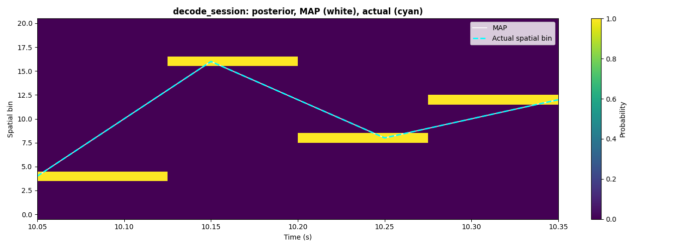
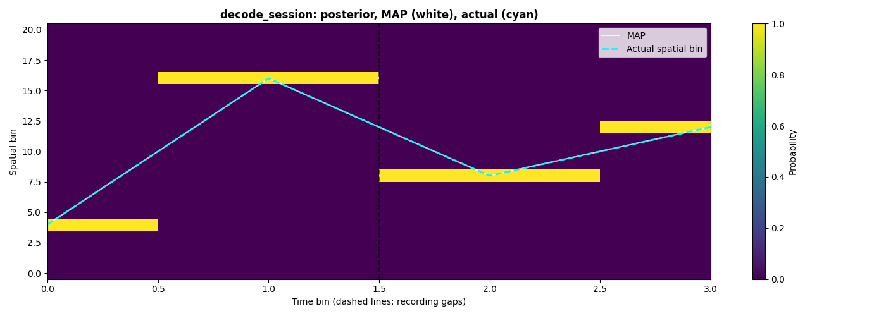

# Researcher-workflow checkpoint — 2026-10-07, after Phase 4d

**Decision: PASS before Phase 5a.** All five journeys execute from current
public documentation and runtime help, with zero implementation or test reads.
The graph route is smooth; the other four are workable. The duration,
geometry/direction, statistical-interpretation and decoder-overlay blockers
are closed. Existing later-phase tasks still matter; passing this checkpoint
establishes usable descriptive workflows, not a finished API or validated
biological inference.

Reviewed integration `d10607a541d3186a1b94e95a6dec7630f67d4add`, following
Phase 4d PR #49 (`d819fbb8`). See the companion
[UX review](UX_REVIEW_2026-10-07_POST_4D.md) and
[design review](DESIGN_REVIEW_2026-10-07_POST_4D.md). The
[first checkpoint](RESEARCHER_WORKFLOW_CHECKPOINT_2026-10-07.md) and
[post-4c repeat](RESEARCHER_WORKFLOW_CHECKPOINT_2026-10-07_POST_4C.md)
remain historical evidence of the two earlier holds.

## Method and limits

Two previously authorized independent reviewers started fresh from current
README, guides, public notebook/companion source and runtime public exports,
signatures, docstrings and result attributes. One covered NWB and graph tracks;
the other covered egocentric, population/statistics and events. Neither used
an earlier review or script as a recipe. The lead reran earlier public-call
scripts as repeatability controls and independently executed the repaired
tutorial cells across all four public copies.

This adapts the journey, probe, UX-dimension and design-axis scopes of
`.claude/workflows/ux-review.js` and `design-review.js` to direct execution.
The checkpoint's public-documentation restriction takes precedence over those
scripts' implementation-inspection prompts. **Implementation reads: 0; test
reads: 0; source-reading fallbacks: 0**, for both reviewers and the lead during
this repeat. No `inspect.getsource`, private imports or private mutations were
used. Public example source/AST and generated output inspection are permitted
documentation/artifact reads. Warning filenames were observed without opening
the named implementation files. Plans were consulted for scope and allocation.

The lead retains earlier implementation context, including Phase 4d, so its
reruns are not blind discovery. Independent walkthroughs provide the fresh
discovery judgments. The reviewers corrected a few of their own scratch
assertions/labels, documented below; no published recipe was silently repaired.

All extras were installed with `uv sync --all-extras`; scripts ran with
`uv run`, Matplotlib Agg and scratch output directories. Every new fixture is
at most 60 seconds. This is synthetic, descriptive and in-sample evidence.
It does not establish held-out decoder accuracy, biological cell identities,
significant reactivation, fitted-GLM inference, external NWB compatibility,
interactive-browser behavior or assistive-technology accessibility.

The original October audit has only a qualitative record: UX **CONFUSING**,
all five design journeys **painful**. Its executable numerical counts are
unavailable. Fresh fixtures and verification/export overhead also differ
between subsequent reviews. **No numerical reduction in calls/LOC is claimed
against any baseline.** The qualitative improvement is that all five now
complete without source recovery, with the graph recipe in one place and the
previous scientific contradictions corrected.

## Journey measurements

The appendix preserves the exact successful independent scripts. LOC counts
nonblank, noncomment physical lines, including imports, fixture construction,
plots, checks and reporting. All calls count AST `Call` sites, not expanded
loop/comprehension invocations or internal library calls. Neurospatial counts
include explicitly called public constructors/functions and methods on
environment, region, model, frame and result objects. NumPy/Matplotlib methods
on returned arrays/axes belong only in all-call counts. Counts are observations,
not targets or readability scores; several reporting lines are long.

| Journey | Current rating | LOC | All calls | Neurospatial calls | Source reads |
| --- | --- | ---: | ---: | ---: | ---: |
| Disk NWB → selected epochs/coverage → population maps → decode → table/static plot/HTML | workable | 93 | 127 | 19 | 0 |
| Graph geometry → outbound/inbound trials → directional fields | smooth | 55 | 63 | 14 | 0 |
| Heading/egocentric frame → object-vector maps/candidate screens | workable | 45 | 86 | 24 | 0 |
| Duration-controlled linear simulation → population encode/decode → assembly/EV | workable | 51 | 95 | 17 | 0 |
| Events → PSTH/raster → regressors → positioned events | workable | 49 | 71 | 9 | 0 |

NWB fixture overhead is separate: **44 LOC / 45 calls / 1 neurospatial call**.
The supplemental event-cohort probe is **30 / 40 / 5**. The independent
tutorial-cell harness is **65 / 108 / 5**; the verbatim guide body it executes
is **30 / 30 / 5**, and the golden/manual plot bodies are **18 / 11 / 2** and
**21 / 11 / 2**. These executed bodies are accounted for separately so `exec`
does not hide their calls. Discovery/counting utilities are outside all totals.

The NWB/graph reviewer first executed a combined script (159 / 222 / 34),
then extracted the two bodies byte-for-byte into standalone scripts, retaining
needed imports/setup and adding only separate result persistence/completion
messages. Both standalone scripts were rerun: result values and SHA-256 hashes
of all seven CSV/PNG/HTML artifacts match the combined run. The table uses
standalone counts, never the combined total twice. No scientific parameter,
fixture, default or check changed during extraction.

## Executed outcomes

### NWB components, clocks and output

A real HDF5 NWB fixture has 900 tracked positions in cm, two tracking runs
`0–19.95` and `25–49.95` seconds, and IDs `[11,37,83,109]`. Eager position,
timestamps and spike arrays remain usable after `NWBHDF5IO` closes. Selected
analysis epochs `[5,30)` and `[35,45)` intersect metadata-derived acquisition
coverage `[8,42)`. The first selected epoch crosses the real tracking gap,
so epochs, ephys coverage and automatic gap exclusion are exercised independently.
An initial scratch fixture avoided the gap in its selected epochs; the reviewer
strengthened coverage before the final run rather than accepting that weaker
test. This changed the scope of the check, without tuning a numerical outcome.

Retained occupancy is **23.85 s**. Maps feed a **237 × 61** posterior with
row-sum error **4.44e-16**; decoder centers lie only in the three valid runs
`[8,19.95)`, `[25,30)` and `[35,42)`. There are two 5.2-second jumps in returned
centers and no fabricated rows inside excluded windows. Removing the **13
recorded spikes in the tracking gap** leaves rates, posterior and times
array-identical. Both results report explicit spike coverage rather than an
assumed window. A deliberately explicit occupancy prior gives zero posterior
mass to eight unoccupied bins; this is a user choice, not a default guarantee.

The four-row summary preserves NWB IDs, with peak rates about 15.01–15.41 Hz.
The physical rate map and bin-index posterior have distinct truthful labels.
Median error **9.44 cm** is resubstitution error on the encoding data. A real
12-frame HTML export contains rendered cyan position markers, embedded rasters
and matching session-time labels spanning all three retained runs. Inspecting
the first raster finds 61 cyan pixels. Sparse frames across gaps trigger the
documented minimum-fps cap: requested 1× becomes **2.48×** effective playback.
Labels preserve the session clock; exact wall-clock playback is not claimed.
Several guide/help consultations still make this route workable rather than smooth.

### Graph geometry and explicit direction

The current joined workflow recipe covers a 100 cm single-edge track,
regions, segmentation, labels and fields. Coordinates `[25,50,75,50,25]` cm
repeat identically as bins `[4,9,14,9,4]` irrespective of travel direction.
The 60-second trajectory gives **six successful outbound and six successful
inbound trials**. Separate direction labels recover planted 60/40 cm peaks
at **62.5/42.5 cm**, each within one 5 cm bin. Saved plots relabel graph-bin
ticks with physical centers and use firing rate in Hz. Branching-track
assignment and navigation metrics are outside this single-edge journey.

### Egocentric frame and candidate screens

The 60-second fixture has `(3000,2)` positions, 3000 finite headings,
`(3000,1)` bearings/distances and `(3000,1,2)` Cartesian egocentric points.
Public frame round-trip and body-axis checks establish ahead/left/right as
`0/+π/2/−π/2`; an east landmark is right `[0,−10]` when facing north.
Coordinates are cm, timestamps seconds and angles radians.

Synthetic object-vector/place models emit **66/86 spikes**. Flat maps have
120 bins, 71 finite, with **37.74 s occupancy** inside the explicitly chosen
0–50 cm distance range. Their scores are **0.824988/0.312998** and information
**3.252264/1.655576 bits/spike**. Both pass the untouched default information
screen and the notebook's illustrative manual thresholds. This limited-coverage
candidate outcome is retained honestly, without tuning criteria or calling
it biological classification. Frame/criterion work remains in Phases 5a/5b.

### Linear population decoding and statistics

`linear_track_session(duration=48, n_laps=8)` returns exactly **24,000 samples**
at 500 Hz, ending **47.998 s**, with truthful metadata and pauses. Fourteen
maps `(14,31)` feed counts `(479,14)` and posterior `(479,31)`; the final
partial decoder bin is dropped as documented. Manual and one-call session
posteriors agree exactly; row-sum error is **5.55e-16**. In-sample median error
**4 cm** is descriptive. Actual positions use `env.bin_at`, x follows the MAP
line, and the posterior retains its `Spatial bin` label.

Control/template/match periods contain 160/160/159 bins. PCA selects two
dimensions/patterns above MP threshold **1.679108**, with empty thresholded
core-member sets and `(2,160)` algorithm-scale projections. Controlled
**EV=0.336724, REV=0.450980**: the larger reverse effect is retained, not tuned
away. Without control, **EV=REV=0.886947**. Match strengths are about 1.12;
tripling the template yields about 2.88–2.96 under the shared baseline.
The sparse counterexample remains mean zero/std one with **10% above 2**.
These are descriptive scales/effects, not calibrated p-values or biological
assembly membership. Public exports/help supply the still poorly indexed
statistics branch; Phase 6a carries its navigation/common-unit-selection work.

### Events and aligned cohorts

The 48-second synthetic neuron emits **153 spikes**. Thirteen input events
yield **11 retained / 2 dropped** with explicit recording coverage and the
full `[-.5,1)` PSTH window. The same retained events produce eleven raster
rows and eleven positioned events, with zero missing coordinates. The
60-bin, 25 ms PSTH peaks at **+0.1375 s, 43.6364 Hz**; count-SEM to Hz scaling
is 40. Signed nearest-event time, counts, indicator, intercept and x/y form
`(960,6)` design columns; no GLM is fitted.

A 3.5-second gap/epoch probe separately has six position-valid events, including
run endpoints, but only two full-window PSTH events, with two retained raster rows and rates
`[0,20,20,0]` Hz. The unconstrained spike-only PSTH retains all ten inputs.
These are the documented point-versus-full-window coverage rules, not a claim
that different helper purposes produce the same cohort. Phase 6b retains the
joined-cohort and handoff work.

## Blocker closure and current tutorial evidence

| Previously held finding | Fresh evidence | Disposition |
| --- | --- | --- |
| Duration/metadata disagree | Independent 1/2 s clocks have 500/1000 samples ending 0.998/1.998 s; full 48 s population route also uses its requested duration. | Closed by Phase 4c. |
| Geometry presented as direction/history | Joined guide preserves repeated bins, supplies explicit outbound/inbound trial labels and recovers both planted peaks. | Closed by Phase 4c. |
| Activation/EV cutoffs presented as significance | Sparse counterexample, controlled/no-control EV and public help agree on descriptive effects and reference thresholds. | Closed by Phase 4c. |
| Physical positions over posterior bin indices | Current golden/manual tutorial cells and guide use actual bin indices and the MAP line's x coordinates, with truthful labels on continuous/gapped clocks. | Closed by Phase 4d. |

The independent reviewer executed the current guide recipe verbatim, then both
current notebook cells. Exact notebook/companion AST parity holds across all
four copies. The lead separately executed **16 cases**: two cells × four
copies × two clocks. Neither run changed published code.

With 5 cm bins, actual `[20,80,40,60]` cm maps to `[4,16,8,12]`. A perfect
four-row posterior gives actual/MAP y exactly those bins and physical error
**0 cm**. Continuous x is `[10.05,10.15,10.25,10.35]` seconds; gapped decoder
times `[10.05,10.15,20.05,20.15]` plot at row indices `[0,1,2,3]`, with a
recording-gap marker and no inserted rows. Axes remain `Spatial bin` and
the appropriate seconds/bin-with-recording-gaps label.





**Remaining nonblocking presentation issue:** public `AxesImage.get_extent()`
uses `[10.05,10.35]` as continuous image boundaries. The four image-column
centers are therefore `[10.0875,10.1625,10.2375,10.3125]`, offset by at most
**37.5 ms** from the correct line timestamps. Gapped image extent `[-.5,3.5]`
centers exactly on row indices. Both reviewers' assigned journey decisions
pass; the reviewer of these plots and the lead explicitly retain this bounded,
sub-half-bin timing offset as Phase 7 presentation work. It does not reopen
the cm-versus-bin contradiction: line data/units, decoded rows and physical
errors are correct. No sub-bin timing claim should be made from these pixels.

### Scratch recovery disclosure

The NWB reviewer initially assumed a JavaScript `frameTimes` variable; the
HTML actually carries baked overlays and matching labels. An initial
continuous-motion assertion ignored repeated coordinate holds in the
convenience trajectory; public-array grouping corrected that check. A draft
graph figure mislabeled bin ticks; its final tick labels use physical centers.
An exploratory same-seed regeneration did not match the convenience RNG
stream; no RNG-equivalence claim is made.

The other reviewer's first cell harness asserted an invented exact gapped
label `Time bin index`. The actual label is `Time bin (dashed lines: recording
gaps)`; only the scratch assertion changed to a semantic prefix check.
The guide and first continuous cell had already executed successfully.
These are reviewer-check/label corrections, not product/API failures; fixture
strengthening is disclosed above. Exact published `plt.show()` calls emit
expected noninteractive-Agg warnings. No implementation reads were needed.

## UX controls, allocation and gate

The lead's earlier real-NWB first-field/error/result scripts reproduce
**78 bins, 59.99 s occupancy, 5.321 Hz peak and 1.176 bits/spike**. Factory,
dimension, grid/time and unit-index diagnostics still guide recovery. The
large-grid warning is raised as an exception before allocation. Six IDs,
viridis, Hz labels and readable reprs remain. Single/batch tables still have
4/9 columns, empty attrs and no singular `to_xarray`; these are Phase 7 tasks.
Native 1D rate-result plotting still raises the documented pcolormesh 2D-grid
error; graph plotting and a labeled ordinary line plot provide usable paths.
These lead reruns are repeatability controls rather than new naive-user counts.

Remaining work stays assigned: Phases 5a/5b for frame/criterion/bias;
6a for navigation and count-statistics/common-unit selection; 6b for
event-cohort/decoder-model handoffs; 6c for joined component/holder NWB recipes;
7 for native 1D plotting, summary/xarray/unit/threshold parity and exports.
This repeat adds only the measured continuous posterior image-centering task
to Phase 7. No new pre-5a correction is required by the executed evidence.

**Gate passed:** all five scoped journeys execute, are clearly easier than
the original qualitative all-painful baseline, require no source fallbacks,
and have no unresolved checkpoint blocker. Merge this report/planning PR,
then start Phase 5a. This checkpoint changes reports/plans only; it does not
change library code, tests, scientific defaults or classification criteria.

## Reproduction appendix

Save the exact scripts below in a temporary directory. Install all extras,
then use `MPLBACKEND=Agg uv run --project /path/to/neurospatial python <script>`.
Run `make_fixture.py` before `nwb_workflow.py`; graph and other journeys build
their own fixtures. Scripts write actual PNG/HTML/JSON/CSV outputs. In the
independent tutorial harness, adjust only the checkout path assigned to `repo`.
The lead's four-copy probe takes that checkout path as its first CLI argument.
Run `decoder_tutorial_cells.py` to execute the verbatim guide and golden/manual
plot bodies: the extracted plot cells require the harness variables and are
not standalone programs. The guide body is standalone; all three extracted
bodies are preserved separately for exact provenance and call accounting.

Original successful scripts, classified AST callsites, metrics, logs, public
help, extraction equivalence and failed scratch attempts remain under
`/private/tmp/neurospatial-checkpoint-post4d-nwb-track` and
`/private/tmp/neurospatial-checkpoint-post4d-ego-stats-events`. Lead controls
and the four-copy probe are under `/private/tmp/neurospatial-checkpoint-post4d`.
The lead fixture/UX/contract controls are the exact scripts already preserved
in the [post-4c appendix](RESEARCHER_WORKFLOW_CHECKPOINT_2026-10-07_POST_4C.md#reproduction-appendix).
Their current numeric outcomes are reported above; they are not included in
the five fresh journey counts.

### Independent NWB input fixture

Exact script: `make_fixture.py`.

```python
from datetime import datetime, timezone
from pathlib import Path
import json
import numpy as np
from pynwb import NWBFile, NWBHDF5IO, TimeSeries
from pynwb.behavior import Position, SpatialSeries
from pynwb.epoch import TimeIntervals
from neurospatial.simulation import generate_poisson_spikes

out = Path(__file__).resolve().parent
runs = [np.arange(0.0, 20.0, 0.05), np.arange(25.0, 50.0, 0.05)]
times = np.concatenate(runs)
phase = (times % 10.0) / 10.0
x = 5.0 + 40.0 * (1.0 - np.abs(2.0 * phase - 1.0))
y = 20.0 + 15.0 * np.sin(2.0 * np.pi * times / 7.0)
positions = np.column_stack([x, y])
unit_ids = [11, 37, 83, 109]
centers = np.array([[15.0, 10.0], [35.0, 10.0], [15.0, 30.0], [35.0, 30.0]])
trains = []
for idx, center in enumerate(centers):
    pieces = []
    for run in runs:
        in_run = (times >= run[0]) & (times <= run[-1])
        intensity = 0.5 + 35.0 * np.exp(-0.5 * np.sum(((positions[in_run] - center) / 8.0) ** 2, axis=1))
        pieces.append(generate_poisson_spikes(intensity, run, seed=100 + idx + int(run[0])))
    spikes = np.sort(np.concatenate(pieces + [np.array([20.2, 21.7, 24.3])]))
    trains.append(spikes[(spikes >= 8.0) & (spikes < 42.0)])
nwbfile = NWBFile(session_description='Deterministic synthetic disk NWB checkpoint', identifier='post4d-nwb', session_start_time=datetime(2026, 10, 7, tzinfo=timezone.utc))
position = Position(name='Position')
position.add_spatial_series(SpatialSeries(name='head_position', data=positions, timestamps=times, reference_frame='arena lower-left (0,0)', unit='cm'))
module = nwbfile.create_processing_module(name='behavior', description='Tracked position')
module.add(position)
for uid, spikes in zip(unit_ids, trains, strict=True):
    nwbfile.add_unit(id=uid, spike_times=spikes)
for start, stop, tag in [(0.0, 4.0, 'warmup'), (5.0, 30.0, 'analysis'), (35.0, 45.0, 'analysis')]:
    nwbfile.add_epoch(start_time=start, stop_time=stop, tags=[tag])
coverage = TimeIntervals(name='ephys_coverage', description='Acquisition on the same session clock')
coverage.add_interval(start_time=8.0, stop_time=42.0)
nwbfile.add_time_intervals(coverage)
nwbfile.add_acquisition(TimeSeries(name='ephys', data=np.zeros(34000, dtype=np.float32), unit='volts', starting_time=8.0, rate=1000.0))
with NWBHDF5IO(str(out / 'session.nwb'), 'w') as io:
    io.write(nwbfile)
fixture = {'session_span_s': [0.0, 50.0], 'tracking_runs_s': [[0.0, 19.95], [25.0, 49.95]], 'recording_gap_s': [19.95, 25.0], 'n_samples': len(times), 'ephys_coverage_s': [[8.0, 42.0]], 'unit_ids': unit_ids, 'spike_counts': [len(s) for s in trains], 'centers_cm': centers.tolist()}
(out / 'fixture.json').write_text(json.dumps(fixture, indent=2) + '\n')
print(json.dumps(fixture, indent=2))
```

### Independent NWB journey

Exact script: `nwb_workflow.py`.

```python
from pathlib import Path
import json
import re
import base64
from io import BytesIO
from PIL import Image
import numpy as np
import matplotlib.pyplot as plt
from pynwb import NWBHDF5IO
from neurospatial import Environment
from neurospatial.io.nwb import read_position, read_units, read_intervals
from neurospatial.encoding import compute_spatial_rates
from neurospatial.decoding import decode_session, decoding_error
from neurospatial.animation import PositionOverlay

out = Path(__file__).resolve().parent
results = {}

# JOURNEY NWB: real component reads; everything used later is eager.
with NWBHDF5IO(str(out / 'session.nwb'), 'r') as io:
    nwbfile = io.read()
    trains, unit_ids = read_units(nwbfile)
    positions, times = read_position(nwbfile, position_name='head_position')
    epoch_table = read_intervals(nwbfile, 'epochs')
    coverage_table = read_intervals(nwbfile, 'ephys_coverage')
    acquisition = nwbfile.acquisition['ephys']
    acquisition_bounds = [float(acquisition.starting_time), float(acquisition.starting_time + acquisition.data.shape[0] / acquisition.rate)]
assert all(isinstance(s, np.ndarray) for s in trains)
assert isinstance(positions, np.ndarray) and isinstance(times, np.ndarray)
assert unit_ids.tolist() == [11, 37, 83, 109]
analysis_epochs = epoch_table.loc[epoch_table['tags'].map(lambda tags: 'analysis' in tags), ['start_time', 'stop_time']].to_numpy()
spike_window = coverage_table[['start_time', 'stop_time']].to_numpy()
np.testing.assert_allclose(spike_window[0], acquisition_bounds)
env = Environment.from_samples(positions, bin_size=5.0, units='cm', name='NWB arena')
rates = compute_spatial_rates(env, trains, times, positions, unit_ids=unit_ids, bandwidth=5.0, min_occupancy=0.05, fill_value=0.0, epochs=analysis_epochs, spike_window=spike_window)
table = rates.summary_table()
table.to_csv(out / 'nwb-unit-summary.csv')
assert table.index.tolist() == unit_ids.tolist()
assert rates.spike_window_assumed is False
valid_spatial = rates.occupancy > 0.0
prior = valid_spatial.astype(float) / valid_spatial.sum()
decoded = decode_session(env, trains, times, positions, dt=0.1, encoding_models=rates.firing_rates, prior=prior, epochs=analysis_epochs, spike_window=spike_window)
assert np.isfinite(decoded.posterior).all()
np.testing.assert_allclose(decoded.posterior.sum(axis=1), 1.0, atol=1e-12)
assert np.all(decoded.posterior[:, ~valid_spatial] == 0.0)
allowed = ((decoded.times >= 8.0) & (decoded.times < 19.95)) | ((decoded.times >= 25.0) & (decoded.times < 30.0)) | ((decoded.times >= 35.0) & (decoded.times < 42.0))
assert allowed.all()
assert not np.any((decoded.times > 19.95) & (decoded.times < 25.0))
assert decoded.spike_window_assumed is False
trains_without_gap = [train[(train < 19.95) | (train >= 25.0)] for train in trains]
rates_without_gap = compute_spatial_rates(env, trains_without_gap, times, positions, unit_ids=unit_ids, bandwidth=5.0, min_occupancy=0.05, fill_value=0.0, epochs=analysis_epochs, spike_window=spike_window)
np.testing.assert_array_equal(rates_without_gap.firing_rates, rates.firing_rates)
decoded_without_gap = decode_session(env, trains_without_gap, times, positions, dt=0.1, encoding_models=rates.firing_rates, prior=prior, epochs=analysis_epochs, spike_window=spike_window)
np.testing.assert_array_equal(decoded_without_gap.posterior, decoded.posterior)
np.testing.assert_array_equal(decoded_without_gap.times, decoded.times)
actual = np.column_stack([np.interp(decoded.times, times, positions[:, dim]) for dim in range(2)])
errors = decoding_error(decoded.map_position, actual)
decoded_frame = decoded.to_dataframe()
decoded_frame['actual_x'] = actual[:, 0]
decoded_frame['actual_y'] = actual[:, 1]
decoded_frame['error_cm'] = errors
decoded_frame.to_csv(out / 'nwb-decoding-summary.csv', index=False)
fig, axes = plt.subplots(1, 2, figsize=(12, 4), constrained_layout=True)
rates.plot(idx=0, ax=axes[0], cmap='hot', colorbar_label='Firing rate (Hz)')
axes[0].set(xlabel='x (cm)', ylabel='y (cm)', title=f'NWB unit {unit_ids[0]}: selected epochs and ephys coverage')
decoded.plot(ax=axes[1], show_map=True, colorbar=True)
plot_x = axes[1].lines[0].get_xdata()
axes[1].plot(plot_x, env.bin_at(actual), 'c--', linewidth=0.8, label='Actual spatial bin')
axes[1].lines[0].set_label('Decoded MAP spatial bin')
axes[1].set(xlabel='Retained decoder time-bin index (session-time ticks)', ylabel='Spatial bin index', title='Decoded posterior; excluded windows omitted')
clock_run_starts = np.r_[0, np.flatnonzero(np.diff(decoded.times) > 0.11) + 1]
label_indices = np.r_[clock_run_starts, len(decoded.times) - 1]
axes[1].set_xticks(label_indices, [f'{decoded.times[i]:.2f} s' for i in label_indices])
axes[1].legend()
fig.savefig(out / 'nwb-rates-and-decoding.png', dpi=140)
plt.close(fig)
frame_indices = np.concatenate([np.arange(start, start + 4) for start in clock_run_starts])
frame_times = decoded.times[frame_indices]
frame_labels = [f'Session time: {t:.2f} s' for t in frame_times]
overlay = PositionOverlay(positions=actual[frame_indices], times=frame_times, color='cyan', size=10.0, trail_length=3)
html_path = env.animate_fields(decoded.posterior[frame_indices], frame_times=frame_times, frame_labels=frame_labels, overlays=[overlay], backend='html', save_path=str(out / 'nwb-position-overlay.html'), title='NWB population posterior: session clock', max_html_frames=20, dpi=70)
html = Path(html_path).read_text()
assert all(label in html for label in frame_labels)
assert 'data:image/png;base64,' in html
embedded_frames = json.loads(re.search(r'const frames = (.*);', html).group(1))
embedded_labels = json.loads(re.search(r'const labels = (.*);', html).group(1))
assert embedded_labels == frame_labels and len(embedded_frames) == len(frame_times)
first_raster = base64.b64decode(embedded_frames[0])
(out / 'nwb-html-first-frame.png').write_bytes(first_raster)
rgba = np.asarray(Image.open(BytesIO(first_raster)).convert('RGB'))
cyan_pixels = (rgba[:, :, 0] < 100) & (rgba[:, :, 1] > 200) & (rgba[:, :, 2] > 200)
assert cyan_pixels.any()
results['nwb'] = {'eager_after_file_close': True, 'unit_ids': unit_ids.tolist(), 'n_units': len(trains), 'spikes_read': [len(s) for s in trains], 'position_samples': len(times), 'tracking_gap_s': [19.95, 25.0], 'selected_epochs_s': analysis_epochs.tolist(), 'ephys_coverage_s': spike_window.tolist(), 'acquisition_bounds_s': acquisition_bounds, 'rate_summary': rates.summary(), 'summary_index': table.index.tolist(), 'summary_columns': list(table.columns), 'spatial_bins_with_occupancy': int(valid_spatial.sum()), 'spatial_bins_with_no_posterior_mass': int((~valid_spatial).sum()), 'decoder_summary': decoded.summary(), 'posterior_shape': list(decoded.posterior.shape), 'posterior_row_sum_max_error': float(np.max(np.abs(decoded.posterior.sum(axis=1) - 1.0))), 'no_excluded_time_rows': bool(allowed.all()), 'recorded_gap_spikes_per_unit': [int(np.sum((train >= 19.95) & (train < 25.0))) for train in trains], 'removing_gap_spikes_leaves_maps_and_posterior_unchanged': True, 'decoder_times_first_last': decoded.times[[0, -1]].tolist(), 'retained_clock_breaks_s': np.diff(decoded.times)[np.diff(decoded.times) > 0.11].tolist(), 'median_resubstitution_error_cm': float(np.median(errors)), 'html_frames': len(frame_times), 'html_frame_times': frame_times.tolist(), 'html_session_labels': frame_labels, 'html_size_bytes': Path(html_path).stat().st_size, 'embedded_raster_frames': len(embedded_frames), 'first_frame_cyan_overlay_pixels': int(cyan_pixels.sum())}
print('NWB', json.dumps(results['nwb'], indent=2))

(out / 'nwb_workflow_results.json').write_text(json.dumps(results, indent=2) + '\n')
print('Completed nwb_workflow.py.')
```

### Independent graph-track journey

Exact script: `graph_track_workflow.py`.

```python
from pathlib import Path
import json
import numpy as np
import matplotlib.pyplot as plt
import networkx as nx
from shapely.geometry import Polygon
from neurospatial import Environment
from neurospatial.encoding import compute_directional_place_fields
from neurospatial.behavior import segment_trials, goal_pair_direction_labels
from neurospatial.simulation import generate_poisson_spikes

out = Path(__file__).resolve().parent
results = {}

# JOURNEY GRAPH: current public guide supplies this explicit-label recipe.
graph = nx.Graph()
graph.add_node(0, pos=(0.0, 0.0))
graph.add_node(1, pos=(100.0, 0.0))
graph.add_edge(0, 1, distance=100.0)
track_env = Environment.from_graph(graph, edge_order=[(0, 1)], edge_spacing=0.0, bin_size=5.0)
track_env.units = 'cm'
repeated = np.array([[25.0, 0.0], [50.0, 0.0], [75.0, 0.0], [50.0, 0.0], [25.0, 0.0]])
linear = track_env.to_linear(repeated)
repeated_bins = track_env.bin_at(repeated)
np.testing.assert_allclose(linear, repeated[:, 0])
assert repeated_bins[0] == repeated_bins[-1] and repeated_bins[1] == repeated_bins[-2]
track_times = np.arange(0.0, 60.0, 0.05)
phase = (track_times % 10.0) / 10.0
x = 10.0 + 80.0 * (1.0 - np.abs(2.0 * phase - 1.0))
track_positions = np.column_stack([x, np.zeros_like(x)])
planted_center = np.where(phase < 0.5, 60.0, 40.0)
intensity = 0.5 + 25.0 * np.exp(-0.5 * ((x - planted_center) / 10.0) ** 2)
spikes = generate_poisson_spikes(intensity, track_times, seed=7)
track_env.regions.add('home', polygon=Polygon([(-1, -5), (15, -5), (15, 5), (-1, 5)]))
track_env.regions.add('goal', polygon=Polygon([(85, -5), (101, -5), (101, 5), (85, 5)]))
position_bins = track_env.bin_sequence(track_times, track_positions, dedup=False)
outbound = segment_trials(position_bins, track_times, track_env, start_region='home', end_regions=['goal'])
inbound = segment_trials(position_bins, track_times, track_env, start_region='goal', end_regions=['home'])
labels = goal_pair_direction_labels(track_times, outbound + inbound)
fields = compute_directional_place_fields(track_env, spikes, track_times, track_positions, labels)
fig, axes = plt.subplots(1, 2, figsize=(10, 3), constrained_layout=True)
peaks = {}
for ax, label, truth in zip(axes, ['home→goal', 'goal→home'], [60.0, 40.0], strict=True):
    field = fields.firing_rates[label]
    recovered = float(track_env.bin_centers[np.nanargmax(field), 0])
    assert abs(recovered - truth) <= 5.0
    peaks[label] = {'planted_cm': truth, 'recovered_cm': recovered, 'error_cm': abs(recovered - truth), 'occupancy_s': float(np.sum(fields.occupancy[label]))}
    track_env.plot_field(field, ax=ax, colorbar_label='Firing rate (Hz)')
    tick_bins = np.array([0, 4, 8, 12, 16, 19])
    ax.set_xticks(tick_bins, [f'{c:.1f}' for c in track_env.bin_centers[tick_bins, 0]])
    ax.set(xlabel='Linear track position (cm; bin centers)', ylabel='Firing rate (Hz)', title=f'{label}: peak {recovered:.1f} cm')
fig.savefig(out / 'graph-directional-fields.png', dpi=140)
plt.close(fig)
fields.to_dataframe().to_csv(out / 'graph-directional-fields.csv', index=False)
results['graph'] = {'n_bins': track_env.n_bins, 'is_linearized_track': track_env.is_linearized_track, 'repeated_coordinates_cm': linear.tolist(), 'repeated_bins': repeated_bins.tolist(), 'n_samples': len(track_times), 'session_span_s': [float(track_times[0]), float(track_times[-1])], 'spike_count': len(spikes), 'outbound_trials': len(outbound), 'inbound_trials': len(inbound), 'outbound_successful': sum(trial.success for trial in outbound), 'inbound_successful': sum(trial.success for trial in inbound), 'label_sample_counts': {str(label): int(np.sum(labels == label)) for label in np.unique(labels)}, 'peaks': peaks, 'summary': fields.summary()}
print('GRAPH', json.dumps(results['graph'], indent=2))

(out / 'graph_track_workflow_results.json').write_text(json.dumps(results, indent=2) + '\n')
print('Completed graph_track_workflow.py.')
```

### Independent egocentric journey

Exact script: `journey3_egocentric.py`.

```python
import json
from pathlib import Path

import matplotlib.pyplot as plt
import numpy as np

from neurospatial import Environment
from neurospatial.encoding import compute_egocentric_rate, is_object_vector_cell, object_vector_score, plot_object_vector_tuning
from neurospatial.ops.egocentric import EgocentricFrame, allocentric_to_egocentric, compute_egocentric_bearing, compute_egocentric_distance, heading_from_body_orientation, heading_from_velocity
from neurospatial.simulation import ObjectVectorCellModel, PlaceCellModel, generate_poisson_spikes, simulate_trajectory_ou

grid_x, grid_y = np.meshgrid(np.linspace(0, 100, 26), np.linspace(0, 100, 26))
env = Environment.from_samples(np.column_stack([grid_x.ravel(), grid_y.ravel()]), bin_size=4.0, units="cm")
positions, times = simulate_trajectory_ou(env, duration=60.0, dt=0.02, speed_units="cm", speed_mean=15.0, speed_std=5.0, seed=49)
headings = heading_from_velocity(positions, times, min_speed=2.0, bandwidth=3.0)
objects = np.array([[50.0, 50.0]])
bearings = compute_egocentric_bearing(positions, headings, objects)
distances = compute_egocentric_distance(positions, headings, objects)
ego_points = allocentric_to_egocentric(positions, headings, objects)
frame = EgocentricFrame(position=np.zeros(2), heading=np.pi / 2)
frame_point = frame.to_egocentric(np.array([[10.0, 0.0]]))
assert np.allclose(frame_point, [[0.0, -10.0]])
assert np.allclose(frame.to_allocentric(frame_point), [[10.0, 0.0]])
body_heading = heading_from_body_orientation(np.array([[1.0, 0.0], [0.0, 1.0]]), np.zeros((2, 2)))
frame_bearings = compute_egocentric_bearing(np.zeros((1, 2)), np.zeros(1), np.array([[10.0, 0.0], [0.0, 10.0], [0.0, -10.0]]))
assert np.allclose(body_heading, [0.0, np.pi / 2])
assert np.allclose(frame_bearings, [[0.0, np.pi / 2, -np.pi / 2]])
ovc_model = ObjectVectorCellModel(env=env, object_positions=objects, preferred_distance=20.0, distance_width=5.0, preferred_direction=np.pi / 2, direction_kappa=4.0, max_rate=60.0, baseline_rate=0.05)
place_model = PlaceCellModel(env=env, center=np.array([30.0, 30.0]), width=8.0, max_rate=40.0, baseline_rate=0.1)
ovc_spikes = generate_poisson_spikes(ovc_model.firing_rate(positions, headings=headings), times, seed=49)
place_spikes = generate_poisson_spikes(place_model.firing_rate(positions), times, seed=50)
options = dict(distance_range=(0.0, 50.0), n_distance_bins=10, n_direction_bins=12)
maps = [compute_egocentric_rate(env, spikes, times, positions, headings, objects, **options, method="gaussian_kde", bandwidth=1.0, min_occupancy=0.05) for spikes in [ovc_spikes, place_spikes]]
screens = [is_object_vector_cell(env, spikes, times, positions, headings, objects, **options) for spikes in [ovc_spikes, place_spikes]]
rows = []
fig, axes = plt.subplots(1, 2, subplot_kw={"projection": "polar"}, figsize=(10, 4))
for name, spikes, result, screen, ax in zip(["object_vector_model", "place_model"], [ovc_spikes, place_spikes], maps, screens, axes, strict=True):
    score = object_vector_score(result.firing_rate.reshape(result.n_distance_bins, result.n_direction_bins))
    info = result.egocentric_spatial_information()
    plot_object_vector_tuning(result, ax=ax, add_colorbar=True)
    ax.set_title(name + ", synthetic 60 s")
    rows.append(dict(model=name, spikes=len(spikes), map_shape=list(result.firing_rate.shape), finite_bins=int(np.isfinite(result.firing_rate).sum()), occupancy_seconds=float(result.occupancy.sum()), peak_rate_hz=float(np.nanmax(result.firing_rate)), preferred_distance_cm=float(result.preferred_distance()), preferred_direction_degrees=float(np.degrees(result.preferred_direction())), score=float(score), information_bits_per_spike=float(info), default_info_only_candidate=bool(screen), illustrative_manual_candidate=bool(score > 0.1 and info > 1.0)))
fig.tight_layout()
fig.savefig("journey3_egocentric.png", dpi=150)
plt.close(fig)
summary = dict(requested_duration_seconds=60.0, sample_span_seconds=float(times[-1] - times[0]), positions_shape=list(positions.shape), headings_shape=list(headings.shape), finite_headings=int(np.isfinite(headings).sum()), bearings_shape=list(bearings.shape), distances_shape=list(distances.shape), egocentric_points_shape=list(ego_points.shape), body_heading_radians=body_heading.tolist(), frame_bearings_radians=frame_bearings.tolist(), rows=rows, interpretation="Synthetic descriptive maps/candidate screens; default information threshold and frame remain current Phase 5 constraints. No biological classification or short-sampling accuracy claim.")
Path("journey3_summary.json").write_text(json.dumps(summary, indent=2))
print(json.dumps(summary, indent=2))
```

### Independent linear population/statistics journey

Exact script: `journey4_population_stats.py`.

```python
import json
from pathlib import Path

import matplotlib.pyplot as plt
import numpy as np

from neurospatial.decoding import AssemblyPattern, assembly_activation, bin_spikes_in_time, decode_position, decode_session, decoding_error, detect_assemblies, explained_variance_reactivation, pairwise_correlations, reactivation_strength
from neurospatial.encoding import compute_spatial_rates
from neurospatial.simulation import linear_track_session

session = linear_track_session(duration=48.0, track_length=120.0, bin_size=4.0, n_place_cells=14, n_laps=8, seed=49)
env, times, positions, spikes = session.env, session.times, session.positions, session.spike_trains
assert positions.shape == (24000, 1)
assert np.isclose(times[-1], 47.998)
assert session.metadata["n_laps"] == 8
rates = compute_spatial_rates(env, spikes, times, positions, bandwidth=5.0, min_occupancy=0.1, fill_value=0.0)
counts, count_times = bin_spikes_in_time(spikes, dt=0.1, t_start=float(times[0]), t_stop=float(times[-1]))
decoded = decode_position(env, counts, rates, dt=0.1, times=count_times)
golden = decode_session(env, spikes, times, positions, dt=0.1, bandwidth=5.0, min_occupancy=0.1)
np.testing.assert_allclose(decoded.posterior, golden.posterior)
np.testing.assert_allclose(decoded.posterior.sum(axis=1), 1.0)
actual = np.interp(decoded.times, times, positions[:, 0])[:, None]
errors = decoding_error(decoded.map_position, actual)
control, template, match = np.array_split(counts, 3)
assemblies = detect_assemblies(template, algorithm="pca", rng=49)
correlations = [pairwise_correlations(period) for period in [control, template, match]]
controlled = explained_variance_reactivation(correlations[1], correlations[2], control_correlations=correlations[0])
uncontrolled = explained_variance_reactivation(correlations[1], correlations[2])
assert uncontrolled.explained_variance == uncontrolled.reversed_ev
pattern_rows = []
for pattern in assemblies.patterns:
    activation = assembly_activation(template, pattern)
    pattern_rows.append(dict(members=pattern.member_indices.tolist(), activation_mean=float(activation.mean()), activation_std=float(activation.std()), fraction_above_2=float(np.mean(activation > 2.0)), match_strength=float(reactivation_strength(template, match, pattern)), amplified_template_strength=float(reactivation_strength(template, 3 * template, pattern))))
sparse_counts = np.concatenate([np.zeros(90), np.ones(10)])[:, None]
sparse_pattern = AssemblyPattern(np.array([1.0]), np.array([0]), 1.0)
sparse_activation = assembly_activation(sparse_counts, sparse_pattern)
np.testing.assert_allclose([sparse_activation.mean(), sparse_activation.std()], [0.0, 1.0], atol=1e-12)
assert np.mean(sparse_activation > 2.0) == 0.1
fig, axes = plt.subplots(2, 1, figsize=(10, 7))
decoded.plot(ax=axes[0], show_map=True, colorbar=True)
plot_times = axes[0].lines[0].get_xdata()
actual_line = axes[0].plot(plot_times, env.bin_at(actual), "c--", label="Actual spatial bin")[0]
np.testing.assert_array_equal(actual_line.get_xdata(), axes[0].lines[0].get_xdata())
assert axes[0].get_ylabel() == "Spatial bin"
axes[0].set_title("Synthetic in-sample decode, matching bin coordinates")
axes[1].plot(assemblies.activations.T)
axes[1].set_xlabel("Time bin within template")
axes[1].set_ylabel("PCA projection (algorithm scale)")
fig.tight_layout()
fig.savefig("journey4_population_stats.png", dpi=150)
plt.close(fig)
summary = dict(requested_duration_seconds=48.0, sample_span_seconds=float(times[-1] - times[0]), positions_shape=list(positions.shape), units=env.units, n_cells=len(spikes), spike_counts=[len(train) for train in spikes], metadata=session.metadata, rate_maps_shape=list(rates.firing_rates.shape), counts_shape=list(counts.shape), posterior_shape=list(decoded.posterior.shape), posterior_row_sum_max_error=float(np.max(np.abs(decoded.posterior.sum(axis=1) - 1.0))), manual_vs_session_max_error=float(np.max(np.abs(decoded.posterior - golden.posterior))), in_sample_median_error_cm=float(np.median(errors)), period_shapes=[list(period.shape) for period in [control, template, match]], n_dimensions_above_mp_threshold=assemblies.n_significant, n_patterns=len(assemblies.patterns), activation_shape=list(assemblies.activations.shape), mp_threshold=float(assemblies.threshold), eigenvalues=assemblies.eigenvalues.tolist(), patterns=pattern_rows, n_pairs=controlled.n_pairs, controlled_ev=float(controlled.explained_variance), controlled_rev=float(controlled.reversed_ev), no_control_ev=float(uncontrolled.explained_variance), no_control_rev=float(uncontrolled.reversed_ev), sparse_values=np.unique(np.round(sparse_activation, 10)).tolist(), sparse_fraction_above_2=float(np.mean(sparse_activation > 2.0)), interpretation="In-sample synthetic decode and descriptive statistics. EV/REV are effect sizes, activation>2 is not a calibrated probability, selected MP dimensions need not have core members; amplified-template strength demonstrates shared-baseline magnitude.")
Path("journey4_summary.json").write_text(json.dumps(summary, indent=2))
print(json.dumps(summary, indent=2))
```

### Independent event journey

Exact script: `journey5_events.py`.

```python
import json
from pathlib import Path

import matplotlib.pyplot as plt
import numpy as np
import pandas as pd

from neurospatial import Environment
from neurospatial.events import add_positions, align_spikes_to_events, event_count_in_window, event_indicator, peri_event_histogram, plot_peri_event_histogram, time_to_nearest_event

duration = 48.0
rng = np.random.default_rng(49)
spike_clock = np.arange(0.0, duration, 0.001)
reward_times = np.concatenate([[0.1], np.arange(4.0, 45.0, 4.0) + rng.normal(0.0, 0.15, 11), [47.8]])
firing_rate = np.full_like(spike_clock, 2.0)
for event_time in reward_times:
    firing_rate += 30.0 * np.exp(-0.5 * ((spike_clock - event_time - 0.15) / 0.08) ** 2)
spikes = spike_clock[rng.random(len(spike_clock)) < firing_rate * 0.001]
window = (-0.5, 1.0)
result = peri_event_histogram(spikes, reward_times, window=window, bin_size=0.025, spike_window=(0.0, duration))
retained_mask = (reward_times + window[0] >= 0.0) & (reward_times + window[1] <= duration)
retained_events = reward_times[retained_mask]
aligned = align_spikes_to_events(spikes, retained_events, window=window)
assert len(aligned) == result.n_events == 11
assert result.n_events_dropped == 2
tracking_times = np.arange(0.0, duration, 0.05)
positions = np.column_stack([30.0 + 20.0 * np.cos(tracking_times / 3.0), 30.0 + 20.0 * np.sin(tracking_times / 4.0)])
env = Environment.from_samples(positions, bin_size=5.0, units="cm")
table = pd.DataFrame({"timestamp": retained_events, "event": "reward"})
event_positions = add_positions(table, times=tracking_times, positions=positions)
event_positions["bin_index"] = env.bin_at(event_positions[["x", "y"]].to_numpy())
signed_time = time_to_nearest_event(tracking_times, retained_events, signed=True, max_time=2.0)
counts = event_count_in_window(tracking_times, retained_events, window=(-0.5, 0.0))
indicator = event_indicator(tracking_times, retained_events, window=(-0.5, 0.0))
np.testing.assert_array_equal(indicator, counts > 0)
design = np.column_stack([np.ones(len(tracking_times)), signed_time, counts, indicator, positions])
response_counts = [int(np.sum((trial >= 0.0) & (trial < 0.4))) for trial in aligned]
fig, axes = plt.subplots(3, 1, figsize=(10, 9))
axes[0].eventplot(aligned)
axes[0].axvline(0.0, linestyle="--", color="black")
axes[0].set_ylabel("Retained trial")
plot_peri_event_histogram(result, ax=axes[1], title="Synthetic reward PSTH, same raster cohort")
axes[2].plot(tracking_times, signed_time)
axes[2].set_xlabel("Session time (s)")
axes[2].set_ylabel("Time from nearest reward (s)")
fig.tight_layout()
fig.savefig("journey5_events.png", dpi=150)
plt.close(fig)
event_positions.to_csv("journey5_event_positions.csv", index=False)
summary = dict(duration_seconds=duration, n_spikes=len(spikes), input_events=reward_times.tolist(), n_retained=result.n_events, n_dropped=result.n_events_dropped, retained_events_seconds=retained_events.tolist(), raster_trials=len(aligned), psth_bins=len(result.bin_centers), peak_seconds=float(result.bin_centers[np.argmax(result.firing_rate)]), peak_rate_hz=float(result.firing_rate.max()), sem_count_to_hz_scale=1 / result.bin_size, tracking_shape=list(positions.shape), regressor_range_seconds=[float(signed_time.min()), float(signed_time.max())], design_shape=list(design.shape), response_counts=response_counts, mean_response_count=float(np.mean(response_counts)), positioned_event_shape=list(event_positions.shape), missing_event_positions=int(event_positions[["x", "y"]].isna().any(axis=1).sum()), event_bins=event_positions.bin_index.tolist(), interpretation="Synthetic PSTH and design columns; no GLM fit or biological inference. Explicit full-window event selection aligns PSTH/raster/regressors/positioned events.")
Path("journey5_summary.json").write_text(json.dumps(summary, indent=2))
print(json.dumps(summary, indent=2))
```

### Supplemental event-cohort probe

Exact script: `event_cohort_probe.py`.

```python
import json
from pathlib import Path

import numpy as np
import pandas as pd

from neurospatial.events import add_positions, align_spikes_to_events, peri_event_histogram
from neurospatial.ops.egocentric import heading_from_velocity

times = np.array([0.0, 0.25, 0.5, 2.0, 2.25, 2.5, 3.5])
positions = np.column_stack([times, np.zeros(len(times))])
event_times = np.array([-0.1, 0.0, 0.25, 0.5, 1.0, 2.0, 2.25, 2.5, 3.5, 4.0])
epochs = [(0.0, 0.5), (2.0, 2.5)]
positioned = add_positions(pd.DataFrame({"timestamp": event_times}), times=times, positions=positions, epochs=epochs)
headings = heading_from_velocity(positions, times, epochs=epochs)
spikes = np.array([0.02, 0.23, 0.27, 0.48, 1.0, 2.02, 2.23, 2.27, 2.48, 3.5])
window = (-0.1, 0.1)
constrained = peri_event_histogram(spikes, event_times, window=window, bin_size=0.05, epochs=epochs)
unconstrained = peri_event_histogram(spikes, event_times, window=window, bin_size=0.05)
psth_mask = np.zeros(len(event_times), dtype=bool)
for start, stop in epochs:
    psth_mask |= (event_times + window[0] >= start) & (event_times + window[1] <= stop)
retained_events = event_times[psth_mask]
raster = align_spikes_to_events(spikes, retained_events, window=window)
positioned_events = event_times[np.isfinite(positioned.x.to_numpy())]
np.testing.assert_array_equal(positioned_events, [0.0, 0.25, 0.5, 2.0, 2.25, 2.5])
np.testing.assert_array_equal(retained_events, [0.25, 2.25])
assert constrained.n_events == len(raster) == 2
assert constrained.n_events_dropped == 8
np.testing.assert_array_equal(np.isfinite(headings), [True, True, True, True, True, True, False])
summary = dict(sample_span_seconds=float(times[-1] - times[0]), sample_times_seconds=times.tolist(), epochs_seconds=epochs, event_times_seconds=event_times.tolist(), position_valid_events_seconds=positioned_events.tolist(), missing_position_events_seconds=event_times[np.isnan(positioned.x.to_numpy())].tolist(), finite_heading_indices=np.flatnonzero(np.isfinite(headings)).tolist(), psth_retained_events_seconds=retained_events.tolist(), constrained_psth_retained=constrained.n_events, constrained_psth_dropped=constrained.n_events_dropped, unconstrained_psth_retained=unconstrained.n_events, unconstrained_psth_dropped=unconstrained.n_events_dropped, raster_trial_lengths=[len(trial) for trial in raster], constrained_psth_rate_hz=constrained.firing_rate.tolist(), interpretation="Position includes observed run endpoints; complete PSTH windows must lie within recording epochs. Isolated samples/gap interiors lack positions; spike-only PSTH has no inferred tracking coverage.")
Path("event_cohort_summary.json").write_text(json.dumps(summary, indent=2))
print(json.dumps(summary, indent=2))
```

### Independent current-guide and tutorial-cell harness

Exact script: `decoder_tutorial_cells.py`.

```python
import ast
import hashlib
import json
import re
from pathlib import Path

import matplotlib.pyplot as plt
import numpy as np

from neurospatial import Environment
from neurospatial.decoding import DecodingResult, median_decoding_error

repo = Path("/Users/edeno/Documents/GitHub/neurospatial")
guide = (repo / "docs/user-guide/workflows.md").read_text()
guide_blocks = re.findall(r"^```python\n(.*?)^```", guide, flags=re.MULTILINE | re.DOTALL)
recipe = next(block for block in guide_blocks if "actual_bins = env.bin_at(actual)" in block and '"Gapped"' in block)
Path("published_overlay_recipe.py").write_text(recipe)
exec(compile(recipe, "published_overlay_recipe.py", "exec"), {})
plt.gcf().savefig("published_overlay_recipe.png", dpi=150)
plt.close("all")
notebook = json.loads((repo / "docs/examples/20_bayesian_decoding.ipynb").read_text())
sources = {}
provenance = []
for cell_index, cell in enumerate(notebook["cells"]):
    source = "".join(cell.get("source", []))
    if cell.get("cell_type") == "code" and "result.plot(" in source and 'label="Actual spatial bin"' in source:
        name = "golden" if "actual_track_bins" in source else "manual"
        sources[name] = source
        Path(f"tutorial20_{name}_plot_cell.py").write_text(source)
        provenance.append(dict(name=name, notebook_cell_index=cell_index, cell_id=cell.get("id"), source_sha256=hashlib.sha256(source.encode()).hexdigest()))
assert set(sources) == {"golden", "manual"}
for folder in ["examples", "docs/examples"]:
    mirror = json.loads((repo / folder / "20_bayesian_decoding.ipynb").read_text())
    mirror_sources = ["".join(cell.get("source", [])) for cell in mirror["cells"] if cell.get("cell_type") == "code"]
    companion_cells = (repo / folder / "20_bayesian_decoding.py").read_text().split("# %%")
    for source in sources.values():
        assert source in mirror_sources
        assert any(ast.dump(ast.parse(source)) == ast.dump(ast.parse(cell.lstrip())) for cell in companion_cells if cell.strip() and not cell.lstrip().startswith("[markdown]"))
env = Environment.from_samples(np.linspace(0.0, 100.0, 21)[:, None], bin_size=5.0, units="cm")
actual = np.array([[20.0], [80.0], [40.0], [60.0]])
actual_bins = env.bin_at(actual)
posterior = np.zeros((len(actual), env.n_bins))
posterior[np.arange(len(actual)), actual_bins] = 1.0
clocks = {"continuous": 10.05 + np.arange(4) * 0.1, "gapped": np.array([10.05, 10.15, 20.05, 20.15])}
rows = []
for cell_name, source in sources.items():
    for clock_name, decoder_times in clocks.items():
        result = DecodingResult(posterior, env, decoder_times)
        context = dict(plt=plt, np=np, result=result, env=env, actual_track=actual, actual_positions=actual, COLORS={"cyan": "cyan"})
        exec(compile(source, f"tutorial20_{cell_name}_plot_cell.py", "exec"), context)
        ax, fig = context["ax"], context["fig"]
        map_line, actual_line = ax.lines[0], ax.lines[-1]
        expected_x = decoder_times if clock_name == "continuous" else np.arange(len(actual))
        np.testing.assert_array_equal(map_line.get_xdata(), expected_x)
        np.testing.assert_array_equal(actual_line.get_xdata(), expected_x)
        np.testing.assert_array_equal(map_line.get_ydata(), actual_bins)
        np.testing.assert_array_equal(actual_line.get_ydata(), actual_bins)
        assert ax.get_ylabel() == "Spatial bin"
        assert ax.get_xlabel() == "Time (s)" if clock_name == "continuous" else ax.get_xlabel().startswith("Time bin")
        assert median_decoding_error(result.map_position, actual) == 0.0
        extent = np.asarray(ax.images[0].get_extent(), dtype=float)
        pixel_x_centers = extent[0] + (np.arange(len(actual)) + 0.5) * (extent[1] - extent[0]) / len(actual)
        fig.savefig(f"tutorial20_{cell_name}_{clock_name}.png", dpi=150)
        rows.append(dict(cell=cell_name, clock=clock_name, decoder_times_seconds=decoder_times.tolist(), expected_plot_x=expected_x.tolist(), actual_plot_x=actual_line.get_xdata().tolist(), actual_plot_y=actual_line.get_ydata().tolist(), map_plot_y=map_line.get_ydata().tolist(), xlabel=ax.get_xlabel(), ylabel=ax.get_ylabel(), median_physical_error_cm=median_decoding_error(result.map_position, actual), image_extent=extent.tolist(), image_x_centers=pixel_x_centers.tolist(), max_image_center_vs_line_offset=float(np.max(np.abs(pixel_x_centers - expected_x)))))
        plt.close(fig)
summary = dict(guide_recipe_executed_exactly=True, synchronized_public_cells_match=True, non_unit_bin_size_cm=5.0, actual_coordinates_cm=actual[:, 0].tolist(), actual_bins=actual_bins.tolist(), posterior_shape=list(posterior.shape), provenance=provenance, rows=rows, interpretation="Published tutorial cells now align actual/MAP line data and labels on both clocks. Continuous image pixel centers have a small bounded sub-bin temporal offset; gapped image centers align exactly. Inspect public AxesImage extent only; no implementation reads or silent recipe repair.")
Path("decoder_tutorial_cells_summary.json").write_text(json.dumps(summary, indent=2))
print(json.dumps(summary, indent=2))
```

### Verbatim current public guide body

Exact script: `published_overlay_recipe.py`.

```python
import matplotlib.pyplot as plt
import numpy as np

from neurospatial import Environment
from neurospatial.decoding import DecodingResult, median_decoding_error

env = Environment.from_samples(
    np.linspace(0.0, 100.0, 21)[:, None], bin_size=5.0, units="cm"
)
actual = np.array([[20.0], [80.0], [40.0], [60.0]])
actual_bins = env.bin_at(actual)
posterior = np.zeros((len(actual), env.n_bins))
posterior[np.arange(len(actual)), actual_bins] = 1.0
clocks = {
    "Continuous": 10.05 + np.arange(4) * 0.1,
    "Gapped": np.array([10.05, 10.15, 20.05, 20.15]),
}
fig, axes = plt.subplots(1, 2, figsize=(10, 3), constrained_layout=True)
for ax, (name, decoder_times) in zip(axes, clocks.items(), strict=True):
    result = DecodingResult(posterior, env, decoder_times)
    result.plot(ax=ax, show_map=True, colorbar=True)
    map_line = ax.lines[0]  # The MAP line precedes recording-gap markers.
    plot_times = map_line.get_xdata()
    actual_line = ax.plot(plot_times, actual_bins, "c--", label="Actual spatial bin")[0]
    expected_x = decoder_times if name == "Continuous" else np.arange(len(actual))
    np.testing.assert_array_equal(actual_line.get_xdata(), expected_x)
    np.testing.assert_array_equal(actual_line.get_ydata(), map_line.get_ydata())
    np.testing.assert_array_equal(actual_line.get_ydata(), [4, 16, 8, 12])
    assert median_decoding_error(result.map_position, actual) == 0.0
    ax.set_title(name)
    ax.legend()
plt.show()
```

### Verbatim golden posterior plot cell

Exact script: `tutorial20_golden_plot_cell.py`.

```python
# Plot posterior rows and the true trajectory in the same spatial-bin coordinates.
fig, ax = plt.subplots(figsize=(14, 5))
n_show = min(500, result.n_time_bins)
result.plot(ax=ax, show_map=True, colorbar=True)
# show_map=True draws the MAP line first. Reuse its x coordinates: seconds for
# continuous recordings, time-bin indices when dashed markers indicate gaps.
plot_times = ax.lines[0].get_xdata()
actual_track_bins = env.bin_at(actual_track)
ax.plot(
    plot_times[:n_show],
    actual_track_bins[:n_show],
    color=COLORS["cyan"],
    linewidth=2,
    linestyle="--",
    label="Actual spatial bin",
)
ax.set_xlim(plot_times[0], plot_times[n_show - 1])
ax.set_title("decode_session: posterior, MAP (white), actual (cyan)", fontweight="bold")
ax.legend(loc="upper right")
plt.tight_layout()
plt.show()
```

### Verbatim manual posterior plot cell

Exact script: `tutorial20_manual_plot_cell.py`.

```python
# Plot posterior probability as heatmap (first 500 time bins)
fig, ax = plt.subplots(figsize=(14, 5))

n_show = min(500, result.n_time_bins)
result.plot(ax=ax, show_map=True, colorbar=True)
plot_times = ax.lines[0].get_xdata()
ax.set_xlim(plot_times[0], plot_times[n_show - 1])

# Convert physical actual positions to the posterior's spatial bins.
actual_position_bins = env.bin_at(actual_positions)
ax.plot(
    plot_times[:n_show],
    actual_position_bins[:n_show],
    color=COLORS["cyan"],
    linewidth=2,
    linestyle="--",
    label="Actual spatial bin",
)

ax.set_title(
    "Decoded Posterior with MAP Estimate (white) and Actual Position (cyan)",
    fontweight="bold",
)
ax.legend(loc="upper right")
plt.tight_layout()
plt.show()
```

### Lead four-copy public-cell probe

Exact script: `plot_examples_probe.py`.

```python
import ast
import json
from pathlib import Path
import re
import sys

import matplotlib.pyplot as plt
import numpy as np

from neurospatial import Environment
from neurospatial.decoding import DecodingResult, median_decoding_error

project = Path(sys.argv[1])
paths = [f"{prefix}/20_bayesian_decoding.{suffix}" for prefix in ("examples", "docs/examples") for suffix in ("py", "ipynb")]
records = []
for path in paths:
    source = (project / path).read_text()
    cells = (["".join(cell["source"]) for cell in json.loads(source)["cells"] if cell["cell_type"] == "code"]
             if path.endswith("ipynb") else re.split(r"^# %%[^\n]*$", source, flags=re.MULTILINE))
    for actual_name in ("actual_track", "actual_positions"):
        selected = []
        for code in cells:
            tree = ast.parse(code)
            plots = any(isinstance(node, ast.Call) and isinstance(node.func, ast.Attribute) and isinstance(node.func.value, ast.Name) and node.func.value.id == "result" and node.func.attr == "plot" for node in ast.walk(tree))
            uses_actual = any(isinstance(node, ast.Name) and node.id == actual_name for node in ast.walk(tree))
            if plots and uses_actual:
                selected.append(code)
        assert len(selected) == 1
        for gapped in (False, True):
            env = Environment.from_samples(np.linspace(0, 100, 21)[:, None], bin_size=5, units="cm")
            actual = np.array([[20.0], [80.0], [40.0], [60.0]])
            bins = env.bin_at(actual)
            clock = np.array([10.05, 10.15, 20.05, 20.15]) if gapped else 10.05 + np.arange(4) * 0.1
            posterior = np.zeros((4, env.n_bins))
            posterior[np.arange(4), bins] = 1
            result = DecodingResult(posterior, env, clock)
            namespace = dict(np=np, plt=plt, env=env, result=result, time_bin_centers=clock, dt=0.1, COLORS={"cyan":"cyan"})
            namespace[actual_name] = actual
            exec(compile(selected[0], path, "exec"), namespace)
            ax = namespace["ax"]
            map_line, actual_line = ax.lines[0], ax.lines[-1]
            expected_x = np.arange(4) if gapped else clock
            np.testing.assert_array_equal(actual_line.get_ydata(), bins)
            np.testing.assert_array_equal(actual_line.get_xdata(), expected_x)
            np.testing.assert_array_equal(map_line.get_ydata(), bins)
            np.testing.assert_array_equal(map_line.get_xdata(), expected_x)
            assert "bin" in ax.get_ylabel().lower()
            assert median_decoding_error(result.map_position, actual) == 0
            left, right, _, _ = ax.images[0].get_extent()
            pixel_centers = left + (np.arange(4) + 0.5) * (right - left) / 4
            records.append(dict(path=path, cell=actual_name, gapped=gapped, overlay_x=actual_line.get_xdata().tolist(), overlay_y=actual_line.get_ydata().tolist(), xlabel=ax.get_xlabel(), ylabel=ax.get_ylabel(), median_error_cm=0, max_pixel_center_offset=float(np.max(np.abs(pixel_centers-expected_x)))))
            if path == paths[0] and actual_name == "actual_track":
                ax.figure.savefig(f"overlay-{'gapped' if gapped else 'continuous'}.png")
            plt.close("all")
Path("plot-examples.json").write_text(json.dumps(records, indent=2))
print(json.dumps({"cases":len(records), "source_reads":0, "test_reads":0,
                  "max_continuous_pixel_offset_seconds":max(row["max_pixel_center_offset"] for row in records if not row["gapped"]),
                  "max_gapped_pixel_offset_bins":max(row["max_pixel_center_offset"] for row in records if row["gapped"])}))
```
